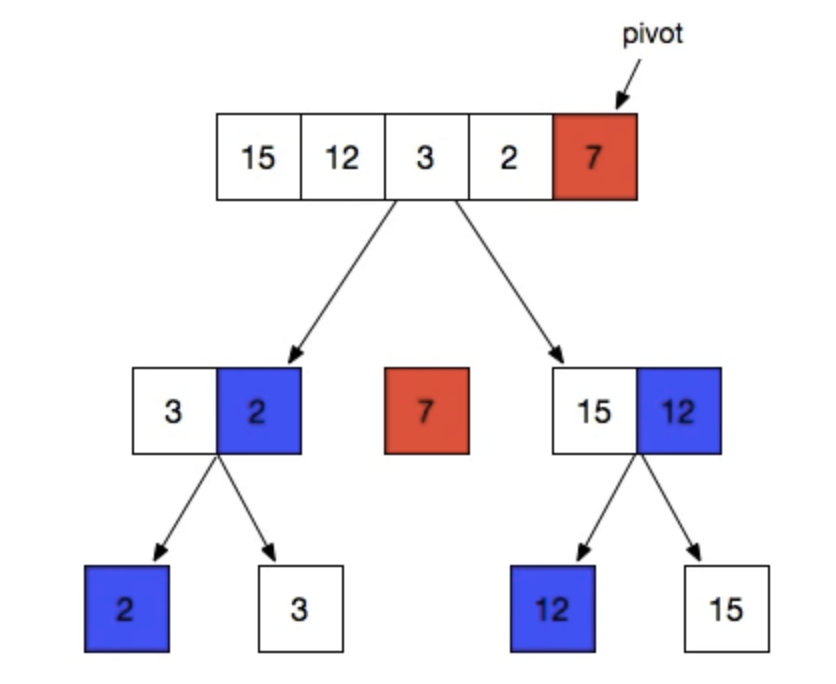
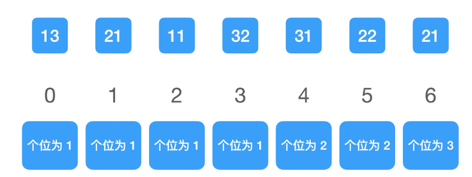
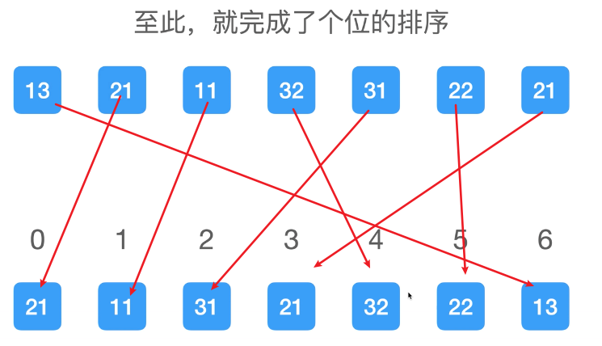
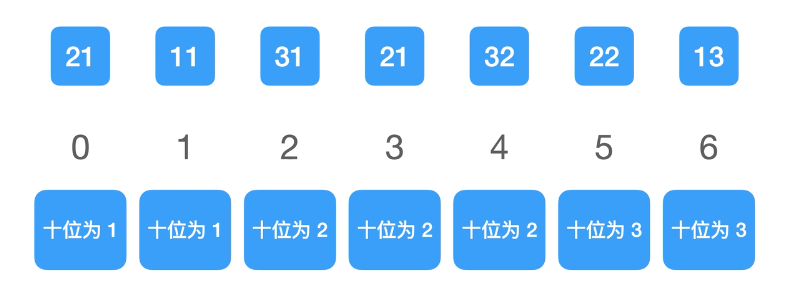
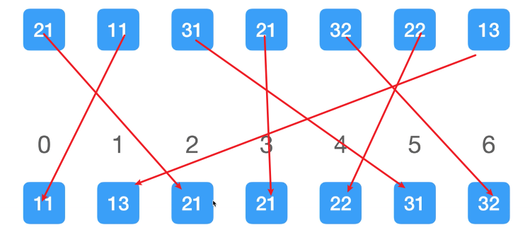

## 算法

.png)

### 冒泡排序

```js
function bubbleSort(arr = []) {
  let len = arr.length
  // 优化
  for(let i = 0; i< len; i++) {
    for(let j = 0; j < len - 1 - i; j++) {
      if(arr[j] > arr[j+1]) {
        // 置换
        [arr[j], arr[j+1]] = [arr[j+1], arr[j]]
      }
    }
  }
  return arr
}
```


### 二分法

待》〉》〉》

### 快速排序

快速排序（英语：Quicksort），又称划分交换排序（partition-exchange sort），简称快排，一种排序算法，最早由东尼·霍尔提出。在平均状况下，排序n个项目要O(nLogn)次比较。在最坏状况下则需要O(n^2)次比较，但这种状况并不常见。事实上，快速排序O(nLogn)通常明显比其他算法更快，因为它的内部循环（inner loop）可以在大部分的架构上很有效率地达成。

### 快速排序的3个基本步骤：

1. 从数组中选择一个元素作为基准点

2. 排序数组，所有比基准值小的元素摆放在左边，而大于基准值的摆放在右边。每次分割结束以后基准值会插入到中间去。

3. 最后利用递归，将摆放在左边的数组和右边的数组在进行一次上述的1和2操作。

   

我们根据上面这张图，来用文字描述一下

1. 选择左右边或任意的元素为基准数，7
2. 将小于7的放在左边，大于7的放在右边，然后将基准数放到中间
3. 然后再重复操作从左边的数组选择一个基准点2
4. 3比2大则放到基准树的右边
5. 右边的数组也是一样选择12作为基准数，15比12大所以放到了12的右边
6. 最后出来的结果就是从左到右 2 ，3，7，12，15了

以上就是一个大概思路。

1. 实现方式：

   ```js
   var quickSort = function(arr) {
     if (arr.length <= 1) {
       return arr;
     }
     var pivotIndex = Math.floor(arr.length / 2);
     var pivot = arr.splice(pivotIndex, 1)[0];
     var left = [];
     var right = [];
   
     for (var i = 0; i < arr.length; i++) {
       if (arr[i] < pivot) {
         left.push(arr[i]);
       } else {
         right.push(arr[i]);
       }
     }
     return quickSort(left).concat([pivot], quickSort(right));
   };
   ```


### 归并排序

归并排序（MERGE-SORT）是建立在归并操作上的一种有效的排序算法,该算法是采用分治法（Divide andConquer）的一个非常典型的应用。将已有序的子序列合并，得到完全有序的序列；即先使每个子序列有序，再使子序列段间有序。若将两个有序表合并成一个有序表，称为二路归并。


归并排序是一种非常稳定的排序方法，它的时间复杂度无论是平均，最好，最坏都是NlogN。

##### 归并排序的2个步骤

1. 先拆分，一直拆分到只有一个数

2. 拆分完成后，开始递归合并

   

   从动图可以看出，归并排序会将一个数组进行两两拆分，一直拆分到只有一个数的时候停止拆分。

   合并的过程就如动图所示

   1. 遍历两组数据
   2. 进行对比大小
   3. 较小的那个值取出来放在第一个位置

   ```js
   function mergeSort(arr){
     if(arr.length===1) return arr
     let mid=Math.floor(arr.length/2)
     return merge(
       mergeSort(arr.slice(0,mid)),
       mergeSort(arr.slice(mid)))
   }
   
   function merge(left,right){
     const res=[]
     while(left.length && right.length){
       if(left[0]<right[0]){
         res.push(left.shift())
       }else{
         res.push(right.shift())
       }
     }
     return [...res,...left,...right]
   }
   ```

   ### 基数排序

   基数排序会对数据分别进行按位排序

   对于示例数据会：[12,21,11,32,31,22,21]

   1. 首先按个位数字大小排序

      记录每个个位上的数字出现的次数

      - 1 出现 4次
      - 2 出现2次
      - 3 出现1次

      对次数求前缀和得到结果4，6，7 。求前缀和是为了得到归位数字的区间

      - 个位为1的数字放到0～3

      - 个位为2的数字放到4～5

      - 个位为3的数字放到6

        

        然后从后向前遍历数组，根据得到的区间将数字从后向前的放置到对应的区间内

        

   2. 然后根据个位排序的结果按十位数字大小排序

      记录每个十位上的数字出现的次数

      - 1 出现 2次
      - 2 出现 3次
      - 3 出现 2次

      对次数求前缀和得到结果2，5，7 。

      - 十位为1的数字放到0～1
      - 十位为2的数字放到2～4
      - 十位为3的数字放到5～6

      

      然后从后向前遍历数组，根据得到的区间将数字从后向前的放置到对应的区间内

      

      代码：

      ```js
      // 获取低 16 位
      function low16(num) {
        return num & 0xffff
      }
      // 获取高 16 位
      function __high16(num) {
        return (num & 0xffff0000) >> 16
      }
      function high16(num) {
        const h = __high16(num)
        return h > 32767 ? h - 32768 : h + 32768
      }
      function radixSort(arr) {
        // 创建计数数组
        const count = Array(65536).fill(0),
          // 获取输入数组长度
          len = arr.length,
          // 创建 temp 数组存储低 16 位排序后的结果
          temp = Array(len)
        // 对低 16 位进行排序
        // 计数
        for (let i = 0; i < len; i++) count[low16(arr[i])]++
        // 前缀和
        for (let i = 1; i < 65536; i++) count[i] += count[i - 1]
        // 归位
        for (let i = len - 1; i >= 0; i--) temp[--count[low16(arr[i])]] = arr[i]
        // 重置 count 数组
        for (let i = 0; i < 65536; i++) count[i] = 0
        // 对高 16 位进行排序
        // 计数
        for (let i = 0; i < len; i++) count[high16(temp[i])]++
        // 前缀和
        for (let i = 1; i < 65536; i++) count[i] += count[i - 1]
        // 归位
        for (let i = len - 1; i >= 0; i--) arr[--count[high16(temp[i])]] = temp[i]
        // 返回结果
        return arr
      }
      
      ```


### 选择排序

1.  第一种

   ```js
   let arr=[6,5,4,3,2,1,0,9,7,8,6]
   function selectSort(arr){
     const ret=[]
     function findInd(arr){//findIdn返回原数组中最小的值的下标
       let ind=0;
       for(let i=0;i<arr.length-1;i++){
         if(arr[i]<arr[ind]) ind=i
       }
       return ind
     }
     while(arr.length){
       ret.push(arr.splice(findInd(arr),1)[0])
     }
     
    return ret
   }
   ```

   缺点是空间复杂度较高

2. 第二种

   ```js
   function selectSort(arr){
     const len=arr.length;
     for(let i=0;i<len-1;i++){
       let idx=i;
       for(let j=i+1;j<len;j++){
         if(arr[j]<arr[idx]) idx =j
       }
       if(idx!==i){
         const temp=arr[idx]
         arr[idx]=arr[i]
         arr[i]=temp
       }
     }
    return arr
   }
   ```

   

### 计数排序

1. 处理非负数

   ```js
   function countSort(arr){
     countArr = [],
     res = [];
     for(let i = 0;i<arr.length;i++){
       if(countArr[arr[i]] === undefined) countArr[arr[i]] = 0
       countArr[arr[i]]++
     }
     for(let i = 0;i<countArr.length;i++){
       while(countArr[i]){
         res.push(i)
         countArr[i]--
       }
     }
     return res;
   }
   ```

   

2. 可以处理负数

   ```js
   const origin=[6,5,4,3,9,9,8,7,-3,-6,-5,1,0]
   function countSort(arr){
     const min=Math.min(...arr),//取最小值 比如origin最小值是-6
     countArr = [],
     res = [];
     for(let i = 0;i<arr.length;i++){
       //arr[i]是6 - 负6就是12 把6放到12的位置，如果arr[i]是 负6 负6-负6就是0，把-6放到0的位置
       if(countArr[arr[i]-min] === undefined) countArr[arr[i]-min] = 0
       countArr[arr[i]-min]++
     }
     for(let i = 0;i<countArr.length;i++){
       while(countArr[i]){
         res.push(i+min) //因为上面减了min，push要加回来
         countArr[i]--
       }
     }
     return res;
   }
   ```

   


