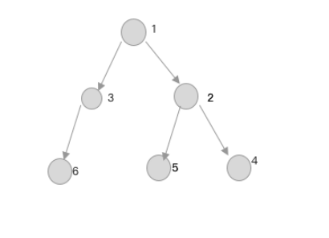

## 栈

栈是一种遵从后进先出(`LIFO`)原则的有序集合，新添加或待删除的元素都保存在栈的同一端，称之为栈顶，另一端叫栈底。

栈的特点：先入后出（手枪弹夹）。

### 创建一个基于数组的栈结构

数组因为有了`push()`和`pop()`方法，非常适合用来表示栈结构，因此我们将创建一个基于数组的类来表示栈：

```js
class Stack {
  constructor () {
    this.items = []
  }
}
```

接下来我们需要为栈声明一些方法：

- `push()`：在栈顶添加一个或者多个元素。
- `pop()`：移除栈顶的第一个元素，同时返回被移除的元素。
- `peek()`：返回栈顶的元素。
- `isEmpty()`：判断栈是否为空，是则返回`true`，否则返回`false`
- `clear()`：移除栈中的所有元素。
- `size()`：返回栈中元素的个数。

```js
class Stack {
  constructor () {
    this.items = []
  }
  push (element) {
    this.items.push(elememt)
  }
  pop () {
    return this.items.pop()
  }
  peek () {
    return this.items[this.size - 1]
  }
  isEmpty () {
    return this.size === 0
  }
  clear () {
    return this.items = []
  }
  size () {
    return this.items.length
  }
}
```

**使用**

```js
const stack = new Stack()
console.log(stack.isEmpty())  // true
stack.push(1)
stack.push(2)
console.log(stack.peek())     // 2
stack.push(4)
console.log(stack.size())     // 3
console.log(stack.pop())      // 4
console.log(stack.size())     // 2
stack.clear()
console.log(stack.isEmpty())  // true
```

### 创建一个基于对象的栈结构

数组是实现栈最简单的方法，且数组的有序的集合，为了保证数组的排列有序，它需要占用更多的内存空间。

因此我们使用基于对象来创建一个栈结构：

```js
class Stack{
  constructor(){
    this.count=0
    this.items={}
  }
}
```

与基于数组的栈结构拥有相同的方法，唯一区别是多了一个`toString()`方法：

- `push()`：在栈顶添加一个或者多个元素。
- `pop()`：移除栈顶的第一个元素，同时返回被移除的元素。
- `peek()`：返回栈顶的元素。
- `isEmpty()`：判断栈是否为空，是则返回`true`，否则返回`false`
- `clear()`：移除栈中的所有元素。
- `size()`：返回栈中元素的个数。
- `toString()`：将栈结构转换为字符串。

现在我们需要使用代码来完善：

```js
class Stack{
  constructor(){
    this.count=0
    this.items={}
  }
  push(element){
    this.items[this.count]=element
    this.count++
  }
  size(){
    return this.count
  }
  isEmpty(){
    return this.size()===0
  }
  pop(){
    if(this.isEmpty()){
      return undefined
    }
    this.count--
    const res=this.items[this.count]
    delete this.items[this.count]
    return res
  }
  peek(){
    return this.items[this.count-1]
  }
  clear(){
    this.count=0
    this.items={}
  }
  toString(){
    if(this.isEmpty()){
      return ''
    }
    let str=this.items['0']
    for(let i=1;i<this.count;i++){
      str=`${str},${this.items[i]}`
    }
    return str
  }
}
```


## 队列

队列的特点：先进先出（水管）

## 链表

`链表` :这种数据结构在javascript中是没有的，需要自己去实现一个.

#### 什么是链表

 链表能够指向内存当中不连续的空间.

每一个链表都有个head指向链表的第一个节点。链表中的每一个节点都有一个存放数据的data和一个next指针，next指向下一个节点，最后一个节点的next（尾指针）为null.

- 单向链表：线性的数据结构；
- 双向链表：每一个节点都有一个pre指针，它指向前一个节点；
- 单向循环链表：尾指针指向head，形成一个闭环；
- 双向循环链表：第一个节点的pre执行尾元素的pre；
- 环形链表：某一节点next指向另一个节点，任意两个节点之间闭环；

## 二叉树

下面就是一个二叉树结构：



看着很像对象的结构，那么二叉树有什么特殊的地方：

- 每个节点都拥有val、left、right属性。
  1. Val：节点对应的值

- 每个节点下由left子树、right子树组成。

  

二叉树遍历逻辑：

- 前序遍历

  先遍历 `自己 ` 》`left子树`  》`right子树` 

- 中序遍历

  先遍历 `left子树 ` 》`自己`  》`right子树` 

- 后序遍历

  先遍历 `left子树 ` 》`right子树`  》`自己` 

