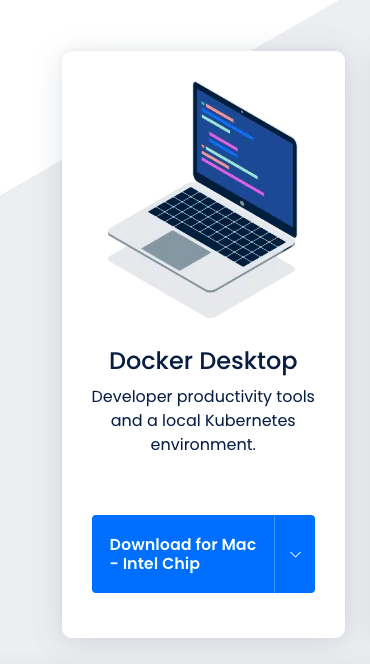
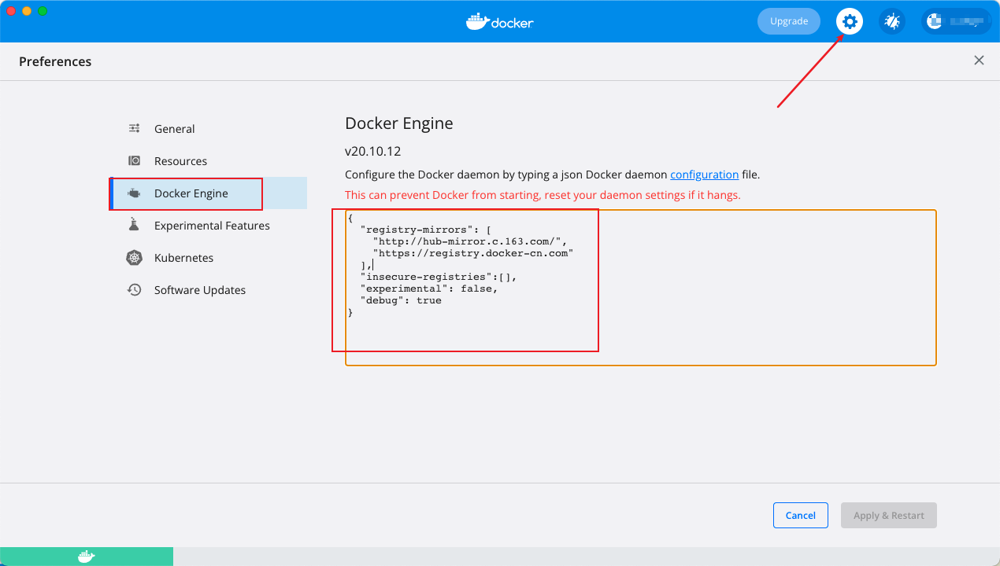
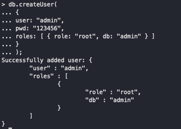

### Docker入门

##### 手把手教你发布前端和node.js

本节我们就来探索一下 `Docker` 的神秘世界，从零到一掌握 `Docker` 的基本原理与实践操作。别再守着前端那一亩三分地，是时候该开疆扩土了。

`本次章节使用mac,个别命令行命令应根据自身操作系统调整 `

#### 认识docker

`Docker` 是一个开源的应用容器引擎，让开发者可以打包他们的应用以及依赖包到一个可移植的容器中，然后发布到任何流行的 `Linux` 机器上，也可以实现虚拟化。容器是完全使用沙箱机制，相互之间不会有任何接口。

`Docker` 技术的**三大核心概念**，分别是：镜像 `Image`、容器 `Container`、仓库 `Repository`。

#### 安装docker

前往[docker官方网站](https://www.docker.com/get-started/)下载



##### 查看版本

```bash
docker -v  
```

#### 配置镜像加速

避免tcp连接超时



```
{
  "registry-mirrors": [
    "http://hub-mirror.c.163.com/",
    "https://registry.docker-cn.com"
  ],
  "insecure-registries":[],
  "experimental": false,
  "debug": true
}
```


#### 快速开始

1. **为了快捷，我们直接使用`Vue` 脚手架构建项目**：

   ```bash
   vue create vue-docker-demo  
   ```

2. **打包**：

   ```bash
   yarn build  
   ```

   打包完成，项目目录下的 `Dist` 就是我们要部署的静态资源了，我们继续下一步。

   **需要注意**：前端项目一般分两类，一类直接 `Nginx` 静态部署，一类需要启动 `Node` 服务。`node`服务拉到最后查看

3. **项目根目录新建Dockerfile**

   ```bash
   cd vue-docker-demo && touch Dockerfile
   ```

   此时项目目录如下：

   ```
   .  
   ├── Dockerfile  
   ├── README.md  
   ├── babel.config.js  
   ├── dist  
   ├── node_modules  
   ├── package.json  
   ├── public  
   ├── src  
   └── yarn.lock  
   ```

4. **准备 `Nginx` 镜像**

   运行 `Docker` 桌面端，就会默认启动实例，我们在控制台拉取 `Nginx` 镜像

   ```bash
   docker pull nginx  
   ```

   控制台会出现如下信息：

   ```
   Using default tag: latest
   latest: Pulling from library/nginx
   42c077c10790: Pull complete 
   62c70f376f6a: Pull complete 
   915cc9bd79c2: Pull complete 
   75a963e94de0: Pull complete 
   7b1fab684d70: Pull complete 
   db24d06d5af4: Pull complete 
   Digest: sha256:2bcabc23b45489fb0885d69a06ba1d648aeda973fae7bb981bafbb884165e514
   Status: Downloaded newer image for nginx:latest
   docker.io/library/nginx:latest
   ```

   如果你出现这样的异常，请确认 `Docker` 实例是否正常运行。

   ```
   Cannot connect to the Docker daemon at unix:///var/run/docker.sock. Is the docker daemon running?  
   ```

   镜像准备 `OK`，我们在根目录创建 `Nginx` 配置文件：

   ```bash
   touch default.conf
   ```

   写入：

   ```nginx
   server {
       listen       80;
       server_name  localhost;
   
       #charset koi8-r;
       access_log  /var/log/nginx/host.access.log  main;
       error_log  /var/log/nginx/error.log  error;
   
       location / {
           root   /usr/share/nginx/html;
           index  index.html index.htm;
       }
   
       error_page   500 502 503 504  /50x.html;
       location = /50x.html {
           root   /usr/share/nginx/html;
       }
   }
   ```

5. **配置镜像**

   打开Dockerfile，写入：

   ```
   FROM nginx  
   COPY dist/ /usr/share/nginx/html/  
   COPY default.conf /etc/nginx/conf.d/default.conf 
   ```

   我们逐行解释一下代码：

   - `FROM nginx` 指定该镜像是基于 `nginx:latest` 镜像而构建的;
   - `COPY dist/ /usr/share/nginx/html/` 命令的意思是将项目根目录下 `dist` 文件夹中的所有文件复制到镜像中 `/usr/share/nginx/html/` 目录下；
   - `COPY default.conf /etc/nginx/conf.d/default.conf` 将 `default.conf` 复制到 `etc/nginx/conf.d/default.conf`，用本地的 `default.conf` 配置来替换 `Nginx` 镜像里的默认配置。

6. **构建镜像**

   Doker通过build命令来构建镜像

   ```bash
   docker build -t vue-docker-demo .
   ```

   我们解释一下上述代码：

   - `-t` 参数给镜像命名 `vue-docker-demo`
   - `.` 是基于当前目录的 `Dockerfile` 来构建镜像

   执行成功后，将会输出：

   ```
   [+] Building 0.3s (8/8) FINISHED                                                                                                                                    
    => [internal] load build definition from Dockerfile                                                                                                           0.0s
    => => transferring dockerfile: 142B                                                                                                                           0.0s
    => [internal] load .dockerignore                                                                                                                              0.0s
    => => transferring context: 2B                                                                                                                                0.0s
    => [internal] load metadata for docker.io/library/nginx:latest                                                                                                0.0s
    => [1/3] FROM docker.io/library/nginx                                                                                                                         0.1s
    => [internal] load build context                                                                                                                              0.1s
    => => transferring context: 6.35MB                                                                                                                            0.1s
    => [2/3] COPY dist/ /usr/share/nginx/html/                                                                                                                    0.0s
    => [3/3] COPY default.conf /etc/nginx/conf.d/default.conf                                                                                                     0.0s
    => exporting to image                                                                                                                                         0.0s
    => => exporting layers                                                                                                                                        0.0s
    => => writing image sha256:14d89b0d41a388d9c682cc679956c1e292fc3a58f4aae41e57bb8a6a4ccc269c                                                                   0.0s
    => => naming to docker.io/library/vue-docker-demo
   ```

   镜像制作成功！我们来查看一下容器：

   ```bash
   docker image ls | grep vue-docker-demo
   ```

   输出镜像信息

   ```
   vue-docker-demo  latest    14d89b0d41a3   45 seconds ago   148MB
   ```

7. **运行容器**

   ```bash
   docker run -d -p 3000:80 --name docker-vue-test vue-docker-demo
   ```

   这里解释一下参数：

   - `-d` 设置容器在后台运行
   - `-p` 表示端口映射，把本机的 `3000` 端口映射到 `container` 的 `80` 端口（这样外网就能通过本机的 `3000` 端口访问了
   - `--name` 设置容器名 `docker-vue-test`
   - `vue-docker-demo` 是我们上面构建的镜像名字

8. **访问项目**

   因为我们映射了本机 `3000` 端口，打开浏览器，访问：`localhost:3000`

9. **发布镜像**

   如果你想为社区贡献力量，那么需要将镜像发布，方便其他开发者使用。

   发布镜像需要如下步骤：

   - 登陆 `[dockerhub](https://hub.docker.com)`，注册账号；
   - 命令行执行 `docker login`，之后输入我们的账号密码，进行登录；
   - 推送镜像之前，需要打一个 `Tag`，执行 `docker tag <image> <username>/<repository>:<tag>`


#### 如果要制作node服务镜像

- **拉取node镜像**

  ```bash
  docker pull node
  ```

  拉取完成如下：

  ```
  latest: Pulling from library/node
  e756f3fdd6a3: Pull complete
  bf168a674899: Pull complete
  e604223835cc: Pull complete
  6d5c91c4cd86: Pull complete
  2cc8d8854262: Pull complete
  b8798d556362: Pull complete
  e8b220cd71fa: Pull complete
  ac6ecea6e097: Pull complete
  b4d2266d5d6c: Pull complete
  Digest: sha256:492afc9bf940bf881eb6906d0b439896b3fd55ffd17bda0002262a7c19ba0ee3
  Status: Downloaded newer image for node:latest
  docker.io/library/node:latest
  ```

- **编写 Dockerfile**

  项目根目录新建Dockerfile,写入：

  ```js
  #使用14.15.0的node版本作为运行软件
  FROM node:14.15.0
  #将此目录作为工作目录
  WORKDIR /usr/src/app
  #复制本目录下的package文件（源文件）到工作目录（目标目录）
  COPY package*.json ./
  #在工作目录执行npm install 
  RUN npm install
  #将本本录下所有文件复制到目标目录
  COPY . .
  #EXPOSE 指令是声明运行时容器提供服务端口，这只是一个声明，在运行时并不会因为这个声明应用就会开启这个端口的服务。
  EXPOSE 7000
  #命令行执行npm run start
  CMD [ "npm", "start" ]
  ```

- **构建镜像**

  ```bash
  docker build -t node_server .
  ```

  **运行容器**

  ```
  docker run -d -p 6060:6060 --name node_server_c node_server
  ```

  

  - **如果node服务需要连接数据库**，例如`mongodb`

    - 拉去mongo镜像

      ```bash
      docker pull mongo:latest
      ```

    - 运行容器

      ```bash
      docker run -itd --name mongo -p 27017:27017 mongo --auth
      ```

      参数说明：

      1. p 27017:27017 ：映射容器服务的 27017 端口到宿主机的 27017 端口。外部可以直接通过 宿主机 ip:27017 访问到 mongo 的服务。

      2. –auth：需要身份密码才能访问容器服务。

         –auth 为可选参数

         - 不填写，无需身份密码进入mongo

         - 填写，步骤如下

           1. 进入容器

              ```bash
              docker exec -it mongo mongo admin
              ```

           2. 创建名为admin,密码123456，权限为root的用户

              ```
              db.createUser(
              {
              user: "admin",
              pwd: "123456",
              roles: [ { role: "root", db: "admin" } ]
              }
              );
              ```

              

      3. itd

         ```
         -i 以交互模式运行容器，通常与-t同时使用
         -t 为容器重新分配一个伪输入终端,通常与-i同时使用
         -d 后台运行容器，并返回容器id
         ```

    - 不设置身份信息项目配置

      ```
       mongoose: {
            client: {
              url: 'mongodb://mongo容器名:27017/nodeServer', //mongo容器名即上方设置的mongo
            }
      }
      ```

    - 设置身份信息

      项目配置：

      ```
      mongoose: {
            client: {
              url: 'mongodb://admin:123456@容器名:27017/nodeServer',//mongo容器名即上方设置的mongo
            }
      }
      ```

    

- **启动node_server容器 关联mongo**

  ```bash
  docker run -d -i -t -p 7001:7001 --name node_c --link mongo:mongo node_server
  ```

  参数说名：

  1. -p  映射的宿主机端口:容器端口
  2. --link 容器关联   mongo容器名:mongo镜像   运行的镜像服务

- 这样本地就可以访问docker中node服务