## jenkins

> Jenkins是一个开源软件项目，是基于Java开发的一种持续集成工具，用于监控持续重复的工作，旨在提供一个开放易用的软件平台，使软件的持续集成变成可能。

### 持续集成、持续交付、持续部署

> 持续集成（Continuous Integration：CI）:代码合并、构建、部署、测试都在一起，不断执行这个过程，并对结果反馈
>
> 持续部署（Continuous Deployment：CD）:部署到测试、生产环境
>
> 持续交付（Continuous Delivery：CD）:部署到生产环境，给用户使用

### docker部署Jenkins

> 这里不在介绍怎么用docker

- **拉去jenkins镜像**

  ```
  docker pull jenkins/jenkins
  ```

- **创建文件夹 jenkins的工作目录**

  `mkdir /Users/hjc/myjenkins` （自己指定自己能找到的文件夹）

- **部署jenkins**

  ```bash
  docker run -d -p 8080:8080 -p 50000:50000 --name jenkins --privileged=true -v /Users/hjc/myjenkins:/var/jenkins_home --env JAVA_OPTS="-Duser.timezone=GMT+08" 
  ```

  参数说明：

  - --env JAVA_OPTS="-Duser.timezone=GMT+08"   将中国时区号传递给Jenkins启动参数，中国在东8区

- **浏览器访问自己指定的端口 localhost:8080（我这是-p 8080）**

  - 需要密码

    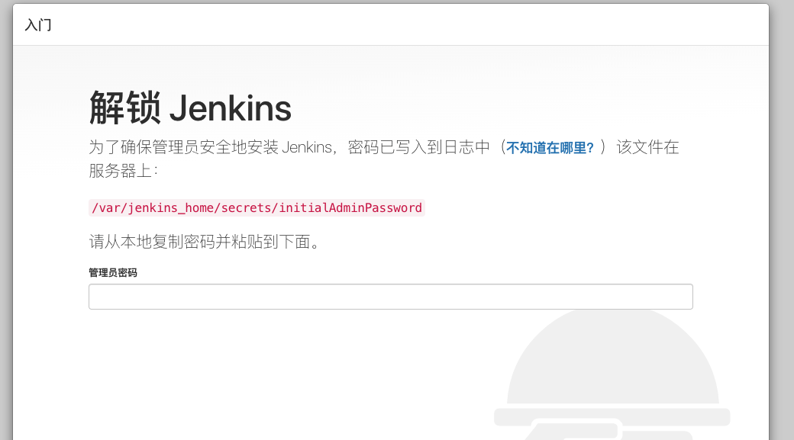

  - 打开docker 运行的jenkins容器

    你也可以使用命令行的形式查看密码：

    ```bash
    docker exec -it jenkins cat /var/jenkins_home/secrets/initialAdminPassword
    ```

    或者：

    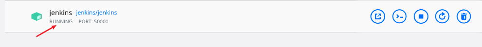

    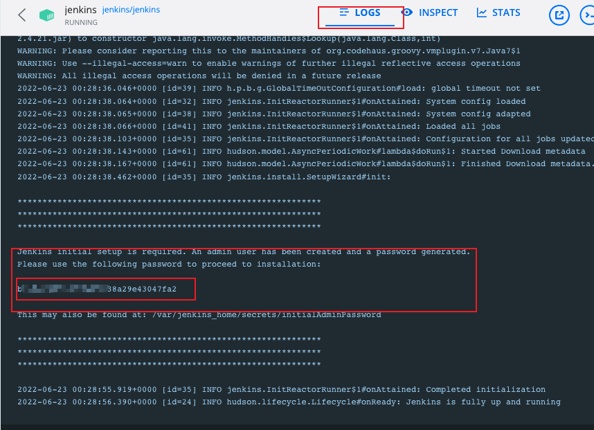

- 安装插件

  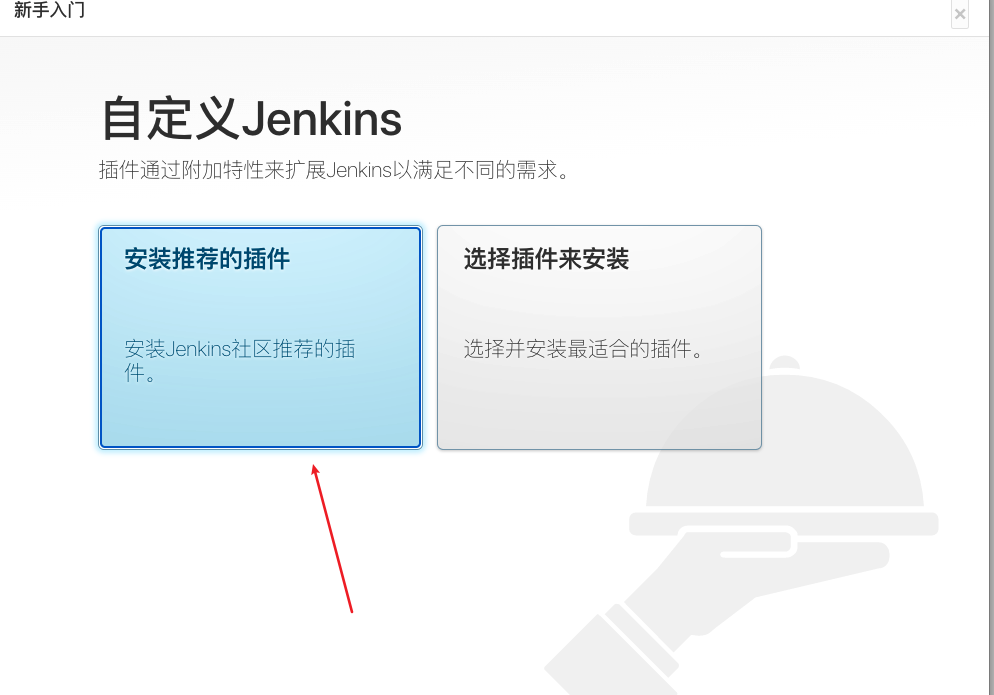

  等待插件安装

  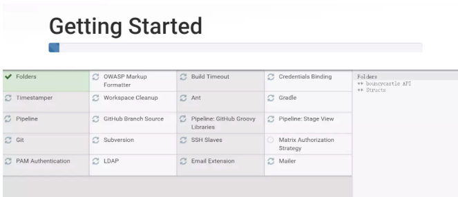

- 创建用户

  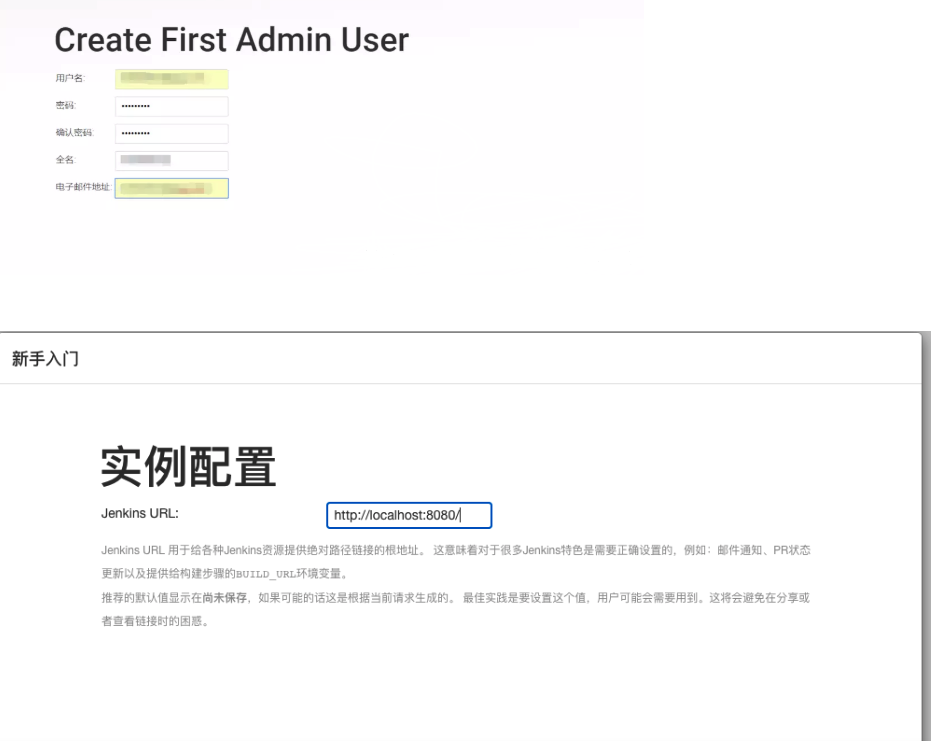

- 进入到页面就完成了jenkins部署初始化了

  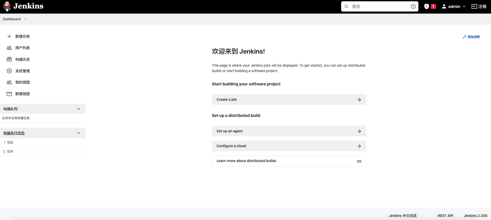


### 持续集成环境部署

- 新建任务

  选第一个自由风格就行

  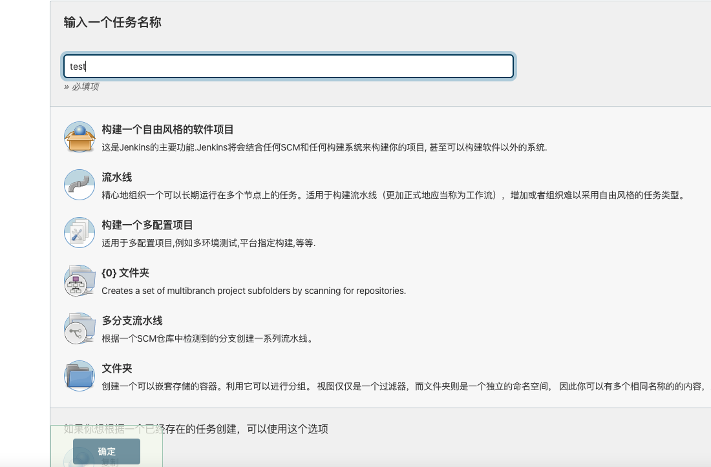

- 简单“描述”你这个任务

- 设定构建记录的最大保留数（天数vs 个数)

- 参数化构建

  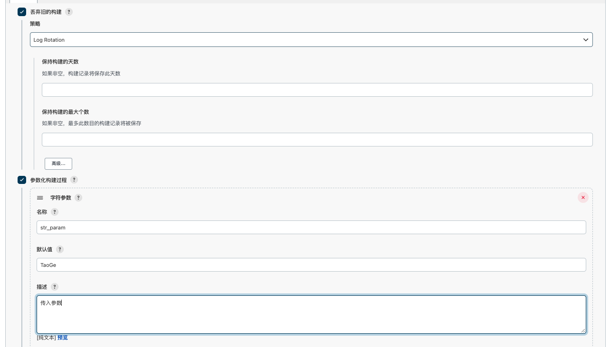

- 定时触发

  > 任务时间描述写法:crontab格式
  > 格式描述：五个部分 -->分钟 小时 日期 月份 星期几

  ```
  H/2 * * * *
  ```

  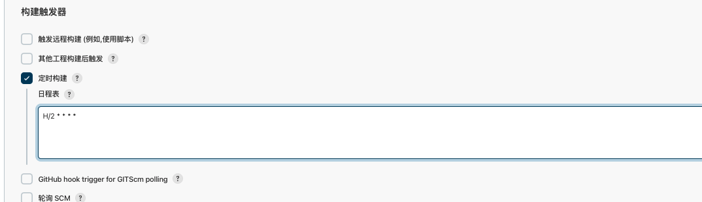

- 构建

  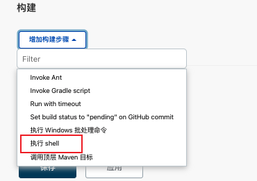

  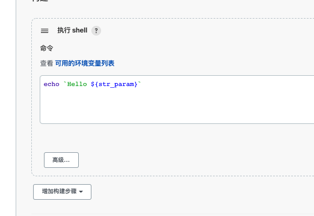

  

  > 保存

  > 回到首页

  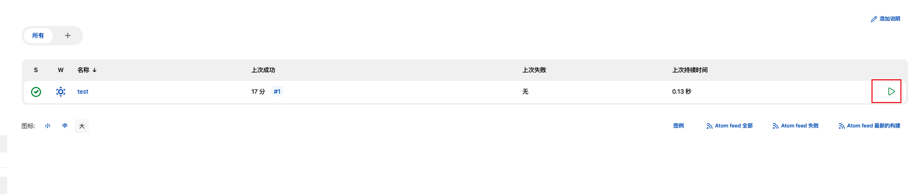

  > 开始构建

  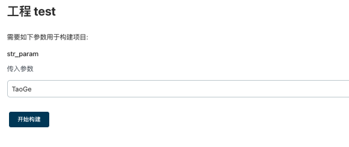

  > 查看构建结果

  

  > 选择用户

  

  > 构建列表

  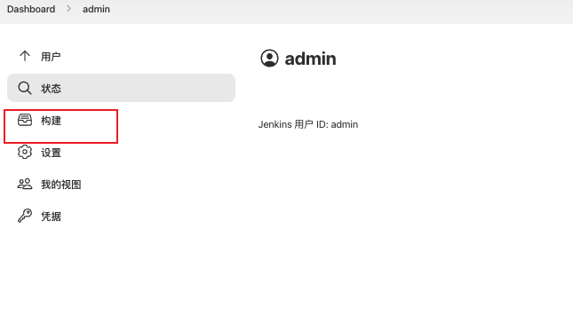

  > 控制台

  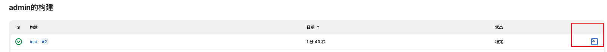

  > 查看输出结果

  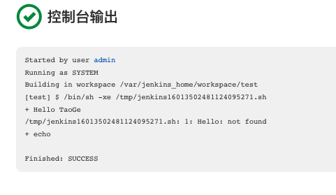

- 管理、配置运行节点

  - 运行节点管理

    - 节点需要配置java环境，Java_Version > 1.5

      安装流程不讲，自行百度

    - 远程用户名密码登录， 或者 公钥私钥认证

    - 配置位置 “系统管理” -> “管理节点”