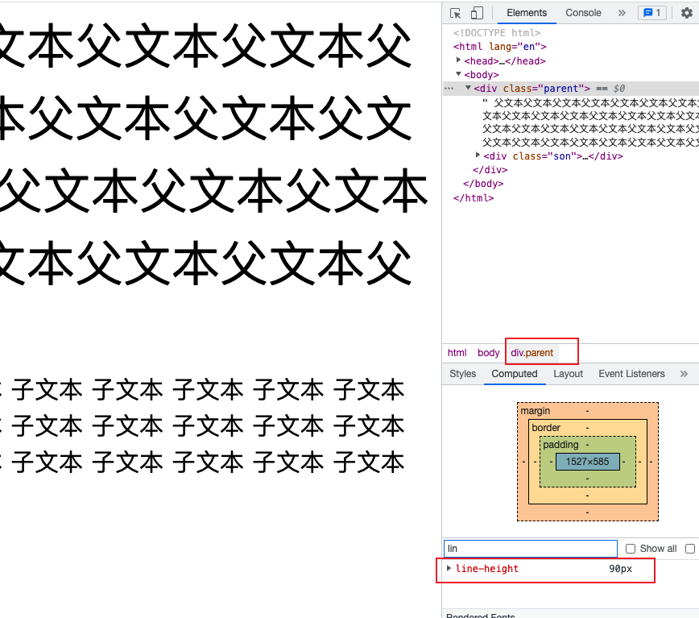
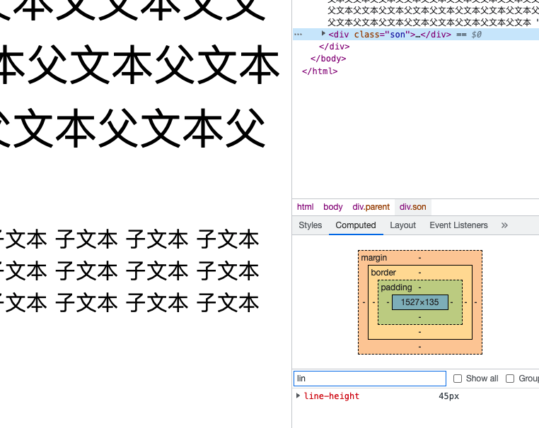
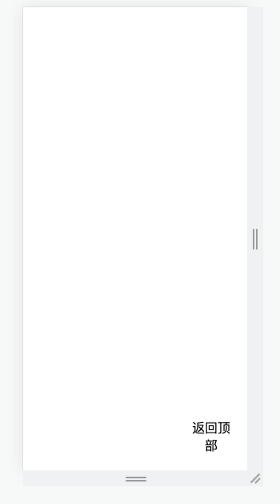
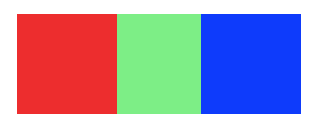

### 脱离文档流是什么意思

元素脱离文档流之后，将不再在文档流中占据空间，而是处于浮动状态（可以理解为漂浮在文档流的上方）。脱离文档流的元素的定位基于正常的文档流，当一个元素脱离文档流后，依然在文档流中的其他元素将忽略该元素并填补其原先的空间。


### line-height数值、百分比、em的区别

> 行高：值不同计算和子元素继承也不同
>
> 行高计算：字体大小*行高值

```

<div class="parent">
  父文本父文本父文本父文本父文本父文本父文本父文本父文本父文本父文本父文本父文本父文本父文本父文本父文本
  父文本父文本父文本父文本父文本父文本父文本父文本父文本父文本父文本父文本父文本父文本父文本父文本父文本
  <div class="son">
    子文本
    子文本
  </div>
</div>
```


- 数值

  ```css
  .parent{
    font-size:60px;
    line-height:1.5; /* 60*1.5 =90px */
  }
  .son{
    font-size:30px;
    /*line-height 继承1.5 30*1.5 =45px */
  }
  ```

  > 父元素行高：90px

  

  > 子元素行高：45px

  

- 百分比、em两者一样

  > 子元素会直接继承父元素计算后的值

  ```css
  .parent{
    font-size:60px;
    line-height:150%; /* 90px */
  }
  .son{
    font-size:30px;
    /*line-height 继承90px */
  }
  ```

  

### 清除浮动方法

**什么是CSS清除浮动？**

在非IE浏览器（如Firefox）下，当容器的高度为auto，且容器的内容中有浮动（float为left或right）的元素，在这种情况下，容器的高度不能自动伸长以适应内容的高度，使得内容溢出到容器外面而影响（甚至破坏）布局的现象。这个现象叫浮动溢出，为了防止这个现象的出现而进行的CSS处理，就叫CSS清除浮动。

```html
<div class="news">

<p>some text</p>
</div>
```

```css
.news {
  background-color: gray;
  border: solid 1px black;
  }

.news img {
  float: left;
  }

.news p {
  float: right;
  }
```


1. **使用带clear属性的空元素**

   在浮动元素后使用一个空元素如`<div class="clear"></div>` ，并在CSS中赋予`.clear{clear:both;}` 属性即可清理浮动。亦可使用`<br class="clear" />` 或`<hr class="clear" />` 来进行清理。

   ```html
   <div class="news">
    
    <p>some text</p>
    <div class="clear"></div>
   </div>
   ```

   ```css
   .news {
     background-color: gray;
     border: solid 1px black;
     }
   
   .news img {
     float: left;
     }
   
   .news p {
     float: right;
     }
   
   .clear {
     clear: both;
     }
   
   ```

   

2. **使用CSS的overflow属性**

   给浮动元素的容器添加overflow:hidden;或overflow:auto;可以清除浮动，另外在 IE6 中还需要触发 hasLayout ，例如为父元素设置容器宽高或设置 zoom:1。

   在添加overflow属性后，浮动元素又回到了容器层，把容器高度撑起，达到了清理浮动的效果。

   ```css
   .news {
     background-color: gray;
     border: solid 1px black;
     overflow: hidden;
     zoom: 1;
     }
   
   .news img {
     float: left;
     }
   
   .news p {
     float: right;
     }
   ```

   ```html
   <div class="news">
    
    <p>some text</p>
   </div>
   ```

3. **使用CSS的:after伪元素**

   结合 :after 伪元素（注意这不是伪类，而是伪元素，代表一个元素之后最近的元素）和 IEhack ，可以完美兼容当前主流的各大浏览器，这里的 IEhack 指的是触发 hasLayout。

   给浮动元素的容器添加一个clearfix的class，然后给这个class添加一个:after伪元素实现元素末尾添加一个看不见的块元素（Block element）清理浮动。

   ```html
   <div class="news clearfix">
     
     <p>some text</p>
   </div>
   ```

   ```css
   .news {
     background-color: gray;
     border: solid 1px black;
     }
   
   .news img {
     float: left;
     }
   
   .news p {
     float: right;
     }
   
   .clearfix:after{
     content: "020"; 
     display: block; 
     height: 0; 
     clear: both; 
     visibility: hidden;  
     }
   
   .clearfix {
     /* 触发 hasLayout */ 
     zoom: 1; 
     }
   ```

   

## 手写题

1. 实现 #content元素固定在屏幕右下角  距离右边20px，距离底部20px，内容水平居中

   效果：

   

   ```html
   <div id='app'>
       <div id='content'>
          返回顶部
     </div>
   </div>
   ```

   ```css
    #app {
      text-align: center;
    }
    #content {
      position: fixed;
      right: 20px;
      bottom: 20px;
    }
   ```

   

2. 实现一个三角形

   

   ```html
   <div class="container"></div>
   ```

   ```css
    .container{
      width: 0px;
      height: 0px;
      border: 100px solid transparent;
      border-bottom: 100px solid red;
    }
   ```

3. 实现一个扇形

   

   ```css
   div {    
   	width: 0;    
   	height: 0;    
   	border-bottom: 50px solid red;    
   	border-right: 50px solid transparent;    
   	border-left: 50px solid transparent;
   	border-radius: 100%;
   }
   ```

   

4. 三栏布局一般指的是页面中一共有三栏，**左右两栏宽度固定，中间自适应的布局**

效果：



 	采用flex布局：

```css
.father {
  display: flex;
  height: 100px;
}

.left {
  width: 100px;
  background: blue;
}

.right {
  width: 100px;
  background: red;
}

.center {
  flex: 1;
  background: lightgreen;
}
```


