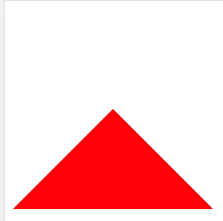

## 手写题

1. 实现 #content元素固定在屏幕右下角  距离右边20px，距离底部20px，内容水平居中

   效果：

   

   ```html
   <div id='app'>
       <div id='content'>
          返回顶部
     </div>
   </div>
   ```

   ```css
    #app {
      text-align: center;
    }
    #content {
      position: fixed;
      right: 20px;
      bottom: 20px;
    }
   ```

   

2. 实现一个三角形

   

   ```html
   <div class="container"></div>
   ```

   ```css
    .container{
      width: 0px;
      height: 0px;
      border: 100px solid transparent;
      border-bottom: 100px solid red;
    }
   ```

3. 实现一个扇形

   ```css
   div {    
   	width: 0;    
   	height: 0;    
   	border-bottom: 50px solid red;    
   	border-right: 50px solid transparent;    
   	border-left: 50px solid transparent;
   	border-radius: 100%;
   }
   ```

   

4. 三栏布局一般指的是页面中一共有三栏，**左右两栏宽度固定，中间自适应的布局**

效果：


采用flex布局：

```css
.father {
  display: flex;
  height: 100px;
}

.left {
  width: 100px;
  background: blue;
}

.right {
  width: 100px;
  background: red;
}

.center {
  flex: 1;
  background: lightgreen;
}
```


