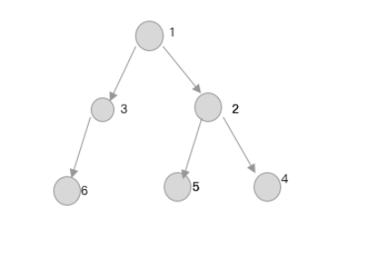

## 数据结构

### 栈和队列

使用数组模拟这种特殊的结构。

- 栈

  栈的特点：先入后出（手枪弹夹）

- 队列

  队列的特点：先进先出（水管）

### 链表

`链表` :这种数据结构在javascript中是没有的，需要自己去实现一个.

#### 什么是链表

 链表能够指向内存当中不连续的空间.

每一个链表都有个head指向链表的第一个节点。链表中的每一个节点都有一个存放数据的data和一个next指针，next指向下一个节点，最后一个节点的next（尾指针）为null.

- 单向链表：线性的数据结构；
- 双向链表：每一个节点都有一个pre指针，它指向前一个节点；
- 单向循环链表：尾指针指向head，形成一个闭环；
- 双向循环链表：第一个节点的pre执行尾元素的pre；
- 环形链表：某一节点next指向另一个节点，任意两个节点之间闭环；

### 二叉树

下面就是一个二叉树结构：

看着很像对象的结构，那么二叉树有什么特殊的地方：

- 每个节点都拥有val、left、right属性。
  1. Val：节点对应的值

- 每个节点下由left子树、right子树组成。

  

二叉树遍历逻辑：

- 前序遍历

  先遍历 `自己 ` 》`left子树`  》`right子树` 

- 中序遍历

  先遍历 `left子树 ` 》`自己`  》`right子树` 

- 后序遍历

  先遍历 `left子树 ` 》`right子树`  》`自己` 

