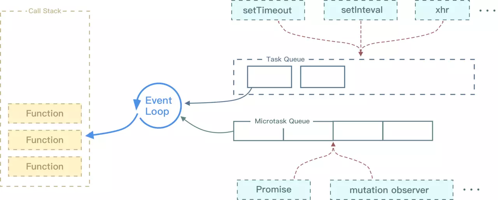

### 基本数据类型

基本类型

**七种基本数据类型**

- string
- number
- boolean
- null
- undefined
- symbol
- bigint

### 引用类型

在javascript中，除了基本数据类型，其他的都是引用类型，引用类型在栈中存储的是指向堆中内容的内存地址，而原始类型在栈中储存的是值

```javascript
var arr=[]
var b=arr
arr.push(1);
console.log(b);//[1]
```

因为它们在内存中使用的是同一个地址

### 类型转换

javascript中，类型转换只有三种

1. 转换成数字

2. 转换成布尔值

3. 转换成字符串

   ##### 经典面试题

   ```javascript
   console.log([]==![]);//true
   ```

**代码分析**：

1. 左侧是一个对象(数组)

2. 右侧是一个布尔值，对象`[]`转换成布尔值`true`，因为除了`null`所有对象都转换成布尔值，所以`![]`结果为`false`

3. 此时相当于`对象==布尔值`，依据类型转换规则，转换成数字类型进行比较

4. 对象(空数组)转换成`0`，布尔值`false`转换成`0`

5. 即`0==0`，返回`true`

   

类型转换规则，如下图：


### NaN是什么和用typeof会输出什么

NaN：Not a Number;表示非数字

Typeof NaN === 'number'


### typeof和instanceof

1. typeof

   typeof`能准确判断除` null`以外的原始类型的值，对于对象类型，除了函数会判断成`function`，其他对象类型一律返回`object

   ```js
   typeof 1          // number
   typeof '1'        // string
   typeof true       // boolean
   typeof undefined  // undefined
   typeof Symbol()   // symbol
   
   typeof []         // object
   typeof {}         // object
   typeof console.log// function
   ```

2. instanceof

   `instanceof`通过原型链可以判断出对象的类型，但并不是百分百准确

   ```js
   function Person(name) {
     this.name = name;
   }
   var p1 = new Person();
   console.log(p1 instanceof Person) // true
   
   var str = new String('abc');
   console.log(str instanceof String)// true
   ```


### new构造调用的过程

无论是通过字面量还是通过`new` 进行构造函数调用创建出来的对象，其实都是一样。调用`new` 的过程如下：

1. 创建一个新对象
2. 原型绑定
3. 绑定this到这个新对象上
4. 返回新对象


### 数字价格千分位分割

> 将123456789变成123,456,789

1. 正则

   对有小数的无效

   ```js
   '123456789'.replace(/(?!^)(?=(\d{3})+$)/g, ',') // 123,456,789
   ```

   or:

   对有小数的无效

   ```js
   var str = "100000000000",
       reg = /(?=(\B\d{3})+$)/g;
   str.replace(reg, ",")
   ```

   or:

   ```js
   function numFormat(num){
     var res=num.toString().replace(/\d+/, function(n){ // 先提取整数部分
          return n.replace(/(\d)(?=(\d{3})+$)/g,function($1){
             return $1+",";
           });
     })
     return res;
   }
   
   var a=1234567894532;
   var b=673439.4542;
   console.log(numFormat(a)); // "1,234,567,894,532"
   ```

   

2. 遍历

   ```js
   function splitNum(num){
     num=num.toString().split(".");//分割小数
     let arr=num[0].split("").reverse();//翻转数组
     let res=[]
     arr.forEach((item,index)=>{
       if(index%3 ===0&& index!==0){
         res.push(',')
       }
       res.push(item)
     })
     res.reverse()
     if(num[1]){ //有小数
       res=res.join("").concat('.'+num[1])
     }else{
        res=res.join("")
     }
     return res
   }
   ```

3. toLocaleString()

   `toLocaleString()` 方法返回这个数字的字符串形式

   ```js
   var a=1234567894532;
   var b=673439.4542;
   
   console.log(a.toLocaleString());  // "1,234,567,894,532"
   console.log(b.toLocaleString());  // "673,439.454"  （小数部分四舍五入了）
   ```

4. Intl.NumberFormat

   ```
   
   let number = 1234567890;
   let nf = new Intl.NumberFormat('en-US');
   nf.format(number); // "1,234,567,890"
   ```

   


### 去除字符串中的html元素

```js
const splitHtmlFun=(str)=>{
  return new DOMParser().parseFromString(str,'text/html').body.textContent;
}
splitHtmlFun("<div>hello world</div>");//hello world
```


### 说一说localStorage、sessionStorage

localStorage和sessionStorage一样都是用来存储客户端临时信息的对象。

- localStorage

  localStorage用于持久化的本地存储，除非主动删除数据，否则数据是永远不会过期的。同源可以读取并修改localStorage数据。

- sessionStorage

  sessionStorage用于本地存储一个会话（session）中的数据，这些数据只有在同一个会话中的页面才能访问
  并且当会话结束后数据也随之销毁。因此sessionStorage不是一种持久化的本地存储，仅、是会话级别的存储。只允许同一窗口访问。

**注意：**

存储值时需要先转换json格式，避免出现错误的类型转换。

### 考察输出结果

#### [NaN].include(NaN)和[NaN].indexOf(NaN)分别输出什么

```js
console.log([NaN].includes(NaN)) // true
console.log([NaN].indexOf(NaN)) // -1
```


### 浏览器输入url回车后都发生了什么

1. ##### 首先是dns，通过域名解析出真实的服务器ip地址

   - 域名结构

     

   - 查找缓存

     - 浏览器中找缓存，浏览器一般会缓存DNS记录一段时间，不同浏览器的时间可能不一样，一般2-30分钟不等，浏览器去查找这些缓存，如果有缓存，直接返回IP，否则下一步。
       - 如果一个域名的DNS解析结果会有多个的话，会优先先第一个ip发起http请求，如果不同再向后面的ip发起请求
     - 查找DNS缓存，查找本机的hosts文件（/etc/hosts），如果找到，直接返回IP，否则下一步。
     - 查找路由器缓存：如果1,2步都查询无果，则需要借助网络，路由器一般都有自己的DNS缓存，将前面的请求发给路由器，查找ISP 服务商缓存 DNS的服务器，如果查找到IP则直接返回，没有的话继续查找。

   - 迭代查询：（缓存中没找到）

     本地域名服务器采用迭代查询，它先向一个根域名服务器查询,根域名服务器告诉本地域名服务器，下一次应查询的顶级域名服务器baidu.com的IP地址。本地域名服务器向顶级域名服务器baidu.com进行查询。顶级域名服务器baidu.com告诉本地域名服务器，下一次应查询的权限域名服务器baidu.com的IP地址。本地域名服务器向权限域名服务器baidu.com进行查询。权限域名服务器baidu.com告诉本地域名服务器，所查询的主机www.baidu.com的IP地址。本地域名服务器最后把结果告诉主机。

     

2. ##### 浏览器与目标服务器建立TCP连接

   - 主机浏览器通过DNS解析得到了目标服务器的IP地址后，与服务器建立TCP连接
   - TCP3次握手连接：浏览器所在的客户机向服务器发出连接请求报文（SYN标志为1）；服务器接收报文后，同意建立连接，向客户机发出确认报文（SYN，ACK标志位均为1）；客户机接收到确认报文后，再次向服务器发出报文，确认已接收到确认报文；此处客户机与服务器之间的TCP连接建立完成，开始通信。

3. ##### 浏览器通过http协议发送请求

   浏览器向主机发起一个HTTP-GET方法报文请求。请求中包含访问的URL，也就是https://www.baidu.com/ ，KeepAlive，长连接，还有User-Agent用户浏览器操作系统信息，编码等。值得一提的是Accep-Encoding和Cookies项。Accept-Encoding一般采用gzip，压缩之后传输html文件。Cookies如果是首次访问，会提示服务器建立用户缓存信息，如果不是，可以利用Cookies对应键值，找到相应缓存，缓存里面存放着用户名，密码和一些用户设置项。

4. ##### 服务器处理请求

   服务器接收到获取请求，然后处理并返回一个响应。

5. ##### 服务器发出一个HTML响应

   返回状态码200 OK，表示服务器可以响应请求，返回报文，由于在报头中Content-type为“text/html”，浏览器以HTML形式呈现，而不是下载文件。

6. ##### 释放TCP连接

   1. 浏览器所在主机向服务器发出连接释放报文，然后停止发送数据
   2. 服务器接收到释放报文后确认发出确认报文，然后将服务器上未传送完的数据发送完。
   3. 服务器数据传输完毕后，向客户机发送连接释放报文
   4. 客户机接收到报文后，发出确定，然后等待一段时间后，释放TCP连接

7. ##### 浏览器显示页面

   在浏览器没有完整接受全部HTML文档时，它就已经开始显示这个页面了，浏览器接收到返回的数据包，根据浏览器的渲染机制对相应的数据进行渲染。渲染后的数据，进行相应的页面呈现和脚步的交互。

8. ##### 浏览器发送获取嵌入在HTML中的其他内容

   比如一些样式文件，图片url，js文件url等，浏览器会通过这些url重新发送请求，请求过程依然是HTML读取类似的过程，查询域名，发送请求，重定向等。不过这些静态文件是可以缓存到浏览器中的，有时访问这些文件不需要通过服务器，直接从缓存中取。某些网站也会使用第三方CDN进行托管这些静态文件。


### 数组方法

**以下是在`ES5` 就支持数组核心方法：**

| 方法        | 描述                                                         |
| ----------- | ------------------------------------------------------------ |
| concat      | 连接2个或者多个数组，返回结果                                |
| every       | 用于检测数组中的所有元素是否都满足指定条件,该条件为一个函数,如果都满足条件则返回true，否则为false |
| filter      | 对数组中的每一个元素运行给定的函数，返回条件为true的元素     |
| forEach     | 对数组中的每一个元素运行给定的函数                           |
| join        | 将所有的数组元素以指定的字符链接成一个字符串                 |
| indexOf     | 返回第一个与给定参数相等的数组元素的索引，没有找到则返回-1   |
| lastIndexOf | 从数组末尾开始搜索，并返回第一个与给定参数相等的数组元素的索引，没有找到则返回-1 |
| map         | 对数组中的每一个元素运行给定的函数，返回每次函数调用的结果组成的数组 |
| reverse     | 翻转数组中元素                                               |
| slice       | 传入索引值，将数组里对应索引范围内的元素作为新数组返回,该方法不会改变原数组 |
| some        | 对数组中的每个元素运行给定的函数，如果任一元素返回`true`，则返回`false` |
| sort        | 按照元素的`ASCII`值进行排序                                  |
| reduce      | 返回数组中所以元素值的合计                                   |
| toString    | 将数组作为字符串返回                                         |
| valueOf     | 和`toString`类似，将数组作为字符串返回                       |

**以下是`ES6`及以上新增的数组方法：**

| 方法       | 描述                                                         |
| ---------- | ------------------------------------------------------------ |
| copyWhthin | 复制数组中的一系列元素到同一数组指定的起始位置。**copyWithin(target,start,end)，所有参数必须为整数** |
| entries    | 返回包含数组所有键值对的`@@iterator`                         |
| @@iterator | 返回一个包含数组键值对的迭代器对象，可以通过同步调用的方式得到数组元素的键值对 |
| find       | 根据回调函数给定的条件从数组中查找元素，如果找到则返回该元素 |
| findIndex  | 根据回调函数给定的条件从数组中查找元素，如果找到则返回该元素的索引 |
| fill       | 用静态值填充数组                                             |
| from       | 将一个类数组转换为一个真正的数组                             |
| of         | 根据传入的参数创建一个新数组                                 |
| values     | 返回包含数组中所以值的`@@iterator`                           |
| includes   | 如果数组中存在某个元素，则返回`true`，否则返回`false`        |
| flat       | 高维数组降维操作,它不会修改原数组的，会有返回值              |
| flatMap    | 第一个参数为回调函数，第二个参数为希望传入回调函数的并作为回调函数内部this参数书写的参数。 |


### es6及以上

描述es6+


#### var、let和const的区别

1. var声明的变量会提升到作用域顶部，而let和const不会进行提升
2. var声明的全局变量会挂载到window对象上，而let和const不会
3. var可以重复声明同一个变量，而let和const不可以
4. var声明的变量作用域范围是函数作用域，而let和const声明的变量作用域范围时块级作用域
5. const 声明的常量，一旦声明则不能再次赋值,再次赋值会报错（更改对象属性不会，因为对象地址没有变）


#### class 类

这就不在多说


#### 模块化es module

```js
// 模块 A 导出一个方法
export const sub = (a, b) => a + b;
// 模块 B 导入使用
import { sub } from './A';
console.log(sub(1, 2)); // 3
```


#### 函数参数默认值

```js
function fun(a=1,b=2){}
```


#### 展开和收缩符

ES6新增加的运算符`...`，称为展开或者收缩，具体作用取决于到底如何使用。

```javascript
//...展开
function foo(x,y,z){
  console.log(x,y,z);//输出1，2，3
}
var arr=[1,2,3]
foo(...arr)


//收缩
function bar(...arr){
  console.log(arr);//[1,2,3,4,5]
}

bar(1,2,3,4,5)
```


#### 对象属性简写

```js
const name="zhangsan"
const obj={name}
```


#### Promise

```js
Promise.resolve().then(() => { console.log(2); });
```


#### 解构赋值

常用的解构赋值有以下两种情况

1. 对象的解构

   ```js
   function bar() {
     return {
       X: 4,
       Y: 5,
       Z: 6
     }
   }
   const {x,y,z} =bar()
   ```

   

2. 数组的解构

   ```js
   function foo() {
     return [1,2,3];
   }
   const [a,b,c] = foo()
   ```

   

####  模版字符串

  ` ${内容} `：模版字符串里的内容可以是变量、函数调用或者表达式

```js
const name="张三"
const str=`我叫${name}`
```


#### 箭头函数

箭头函数:

1. 箭头函数不能new 
2. 箭头函数没有this,它的this是外层函数的
3. 没有arguments

```js
let foo=()=>{}
```


#### 指数操作符

```
2**10;//1024
```


#### 数组方法

##### includes()

```js
arr.includes(valueToFind[, fromIndex])
```

- valueToFind:需要查找的值
- fromIndex：可选 从`fromIndex` 索引处开始查找 `valueToFind`。如果为负值（即从末尾开始往前跳 `fromIndex` 的绝对值个索引，然后往后搜寻）。默认为 0。

##### map

map方法根据回调函数返回值，返回新的数组

```js
let arr=[1,2,3,4,5]
const newArr=arr.map((item,index,arr)=>{
 return item+1
})
```

- 接收一个函数
  - 参数1:当前的元素
  - 参数2:索引
  - 参数3:原数组


##### filter

filter() 方法创建一个新的数组，新数组中的元素是通过检查指定数组中符合条件的所有元素；

```js
let arr=[1,2,3,4,5]
const newArr=arr.filter((item,index,arr)=>{
 return item>3
})
```

##### reduce

reduce() 方法接收一个函数作为累加器，数组中的每个值（从左到右）开始缩减，最终计算为一个值。

```js
let arr=[1,2,3,4,5]
const sum=arr.reduce((total,currentValue,currentIndex,arr)=>{
 return total+currentValue
},0);//15
```

reduce方法参数

- 必须。回调函数

  回调函数的参数

  1. total:必需。*初始值*, 或者计算结束后的返回值。
  2. *currentValue*:必需。当前元素
  3. currentIndex:可选。当前元素的索引
  4. arr:可选。当前元素所属的数组对象。

- 可选。传递给函数的初始值

##### flat

数组扁平化

```js
[1, 2, [3, 4]].flat(Infinity); // [1, 2, 3, 4]
```

##### flatMap()

map和flat结合

```js
[1, 2, 3, 4].flatMap(a => [a**2]); // [1, 4, 9, 16]
```


#### 对象方法

##### values

`Object.values` 方法返回一个数组，成员是参数对象自身的（不含继承的）所有可遍历（enumerable）属性的键值。

```js
const obj = {
  name: "jimmy",
  age: 18,
  height: 188,
};
console.log(Object.values(obj)); // [ 'jimmy', 18, 188 ]
```

##### keys

`Object.keys` 方法返回一个数组，成员是参数对象自身的（不含继承的）所有可遍历（enumerable）属性的键。

```js
const obj = {
  name: "jimmy",
  age: 18,
  height: 188,
};
console.log(Object.keys(obj)); // [ 'name', 'age', 'height' ]
```

##### entries

Object.entries() 方法返回一个数组，成员是参数对象自身的（不含继承的）所有可遍历属性的键值对数组。

```js
const obj = {
  name: "jimmy",
  age: 18,
  height: 188,
};
console.log(Object.entries(obj)); // [ [ 'name', 'jimmy' ], [ 'age', 18 ], [ 'height', 188 ] ]
console.log(Object.entries([1, 2, 3])); // [ [ '0', 1 ], [ '1', 2 ], [ '2', 3 ] ]

```


#### String padding

ES2017 引入了`字符串 `补全长度的功能。如果某个字符串不够指定长度，会在头部或尾部补全。`padStart()`用于头部补全，`padEnd()`用于尾部补全。

一共接受两个参数，第一个参数用来指定字符串的最小长度，第二个参数是用来补全的字符串。

```js
let str="hello"
str=str.padStart(10);//'    hello'
str=str.padStart(10,'h');'hhhhhhello'

str=str.padEnd(10);//'hello     '
str=str.padStart(10,'o');'helloooooo'
```


#### 函数参数列表结尾允许逗号

```
function fun(a,){}
```

####  Object.getOwnPropertyDescriptors()

获取一个对象的所有自身属性的描述符,如果没有任何自身属性，则返回空对象。

```js
let obj={a:1}
Object.getOwnPropertyDescriptors(obj);

//返回：
{
  a:{
    configurable:true,
    enumerable:true,
    value:1,
    writable:true
  }
}
```


#### map和set结构

- Map结构：对象是创建无序键值对数据结构映射的主要机制，在es6之前对象属性只能是字符串，在es6之后，Map结构允许使用对象、数组等作为键。Map结构的方法或者属性如下：

  - `set()` :新增一个map结构数据
  - `get()`: 根据键获取值
  - `size` : 获取map结构的长度
  - `delete(key)` :  根据键删除对应的数据
  - `has(key)` : 判断指定的键是否存在于map结构中
  - `keys()` 遍历，`values()` 遍历，`entries()` 键值对遍历
  - `clear()` :清空map结构

  ```js
  // Map结构
  var map = new Map();
  var x = { id: 1 },
      y = { id: 2 };
  
  // 设置map数据
  map.set(x,'bar');
  map.set(y,'foo');
  
  // 获取map数据
  console.log(map.get(x));  // 输出bar
  console.log(map.get(y));  // 输出foo
  
  // 获取map结构的长度
  console.log(map.size);    // 输出2
  
  // 根据指定键删除map数据
  map.delete(x);
  
  // 根据指定的键判断是否存在于map结构中
  console.log(map.has(x));  // 输出false
  
  // 遍历map键
  for(var key of map.keys()) {
    console.log(key);       // 输出{id:2}
  }
  
  // 遍历map值
  for(var value of map.values()) {
    console.log(value);     // 输出foo
  }
  
  // 遍历map键值对
  for(var item of map.entries()) {
    console.log(item[0]);   // 输出y
    console.log(item[1]);   // 输出{id:2}
  }
  ```

- Set结构:Set是一个集合，它里面的值是唯一的，重复添加会被忽略（Set结构不允许强制类型转换，1和'1'被认为两个不同的值）。Set结构的方法和属性如下：

  - `add()` :添加新值
  - `size` :获取Set结构的长度
  - `delete(key)` : 根据指定的键删除
  - `has(key)` : 判断指定的键是否存在Set集合中
  - `keys()` : 遍历，`values()` : 遍历，`entries()` : 遍历
  - `clear()` : 清空Set结构

  ```js
  var set = new Set();
  var x = { id: 1 };
  var y = { id: 2 };
  var a = 1;
  var b = "1";
  var c = true
  
  // 添加Set数据
  set.add(x);
  set.add(y);
  set.add(a);
  set.add(b);
  set.add(c);
  
  // 获取Set数据的长度
  console.log(set.size);  // 输出5
  
  // 删除Set数据
  set.delete(c);
  
  // 判断某个值是否存在Set结构中
  console.log(set.has(c));// 输出false
  
  // 遍历Set的键
  for(var key of set.keys()) {
    console.log(key);     // 输出{id：1} {id:2} 1 "1"
  }
  
  // 遍历Set的值
  for(var value of set.values()) {
    console.log(value);   // 输出{id:1} {id:2} 1 "1"
  }
  
  // 遍历Set的键值对
  for(var item of set.entries()) {
    console.log(item[0]); // 输出 {id:1} {id:2} 1 "1"
    console.log(item[1]); // 输出 {id:1} {id:2} 1 "1"
  }
  ```


#### proxy

**Proxy** 对象用于创建一个对象的代理，从而实现基本操作的拦截和自定义（如属性查找、赋值、枚举、函数调用等）。

- 使用方法

  ```js
  var p = new Proxy(target, handler);
  ```

  - target: 要使用 `Proxy` 包装的目标对象（可以是任何类型的对象，包括原生数组，函数，甚至另一个代理）。
  - handler:  一个通常以函数作为属性的对象，各属性中的函数分别定义了在执行各种操作时代理 `p` 的行为。
    - get：读取
    - set：修改
    - has：判断对象是否有该属性
    - construct：构造函数
    - ...


#### async/await

**注意点**:

- await 只能在 async 标记的函数内部使用，单独使用会触发 Syntax error。
- await后面需要跟异步操作，不然就没有意义，而且await后面的Promise对象不必写then，因为await的作用之一就是获取后面Promise对象成功状态传递出来的参数。

#### 异步迭代

Await 可以和for...of循环使用，以串行的方式运行异步操作

```js
async function process(arr){
  for await (let i of arr){
    //doSomething
  }
}
```


#### Promise.finally()

不管promise最后的状态是什么，在执行完then或catch执行的回调函数以后，都会执行finally方法指定的回调函数

```
Promise.resolve().then().catch(e => e).finally();
```


#### 去除字符串首尾空白字符 

返回去除空白后的字符

```js
let str=' 1 '
str=str.trimStart()
str=str.trimEnd()
```


#### 空值处理

表达式在??的左侧运算符求值为undefined或null则返回右侧

```js
0 ?? 1 // 0
false ?? true //false
'' ?? false //''
null ?? 'hello' //hello
undefined ?? 1000 //1000
```


#### 可选链

?.检测不确定的中间节点

```js
let user = {}
let u1 = user.childer.name // TypeError: Cannot read property 'name' of undefined
let u1 = user.childer?.name // undefined
```


####  import()

按需导入


#### 新增基本数据类型Bigint

> 任意精度的整数


#### replaceAll

> 返回一个全新的字符串，所有符合匹配规则的字符都将被替换

```js
let str = 'hello world';
str = str.replaceAll('l', ''); // "heo word"
```


#### 数字分隔符

> 数字分隔符，可以在数字之间创建可视化分隔符，通过_下划线来分割数字，使数字更具可读性

```
const money=1_000_000
```


#### 逻辑运算符和赋值表达式

> 逻辑运算符和赋值表达式，新特性结合了逻辑运算符（&&，||，??）和赋值表达式而JavaScript已存在的 复合赋值运算符有：

```js
a ||= b
//等价于
a = a || (a = b)

a &&= b
//等价于
a = a && (a = b)

a ??= b
//等价于
a = a ?? (a = b)
```


### 什么是闭包

> 闭包是指有权访问另一个函数作用域中的变量的函数

##### 词法作用域对执行环境的保护

javascript的作用域有两部分组成即词法作用域和动态作用域

词法作用域是静态的：

```javascript
var x=1;
function a(){
  var y=1
  function b(){
   var z=2;
   console.log(x,y,z)
  }
}
//在a或者全局作用下都无法访问z

//b无论在何处执行都是可以读取x,y,z
```


当一个函数能够记住并访问它所在的词法作用域的时候，就产生了闭包，即使函数是在词法作用域之外执行


**闭包的几种表现形式**

1. 返回一个函数

   这种形式的闭包在javascript的代码编写中，是非常常见的一种方式。

   ```javascript
   var a=1
   function foo(){
     var a=2;
     
     //这就是闭包
     return function (){
       console.log(a)
     }
   }
   
   var bar = foo();
   // 输出2，而不是1
   bar();
   ```

2. 作为函数参数传递

   无论通过何种手段将内部函数传递到它所在词法作用域之外，它都会持有对原始作用域的引用，无论在何处执行这个函数，都会产生闭包。

   ```javascript
   var a=1
   function foo(){
     var a=2
     function baz(){
       console.log(a)
     }
     bar(baz)
   }
   
   function bar(fn){
     fn();//这就是闭包
   }
   bar();//输出2
   ```

   

3. 回调函数

   定时器、事件监听、ajax请求、跨窗口通信、Web Workers或者任何异步中，只要使用了回调函数，实际上就是在使用闭包。

   ```javascript
   setTimeout(function tiemHandle(){
     console.log("timer")
   },100)
   
   // 事件监听
   $('#container').click(function(){
     console.log('DOM Listener');
   })
   ```

   

4. 非典型闭包IIFF(立即执行函数表达式)

   IIFF（立即执行函数表达式）并不是一个典型的闭包，但它确实创建了一个闭包。

   ```javascript
   var a=1;
   (function IIFF(){
     console.log(a)
   })()
   ```

   

##### 经典循环和闭包面试题

思考一下代码运行结果是什么，如何改进

```javascript
for(var i=1;i<=5;i++){
 setTimeout(()=>{
  console.log(i)
 },i*1000)
}
```

**代码分析**：

1. for循环创建了5个定时器，并且定时器是在循环结束后才开始执行
2. for循环结束后，用var 定义的变量i此时等于6
3. 依次执行五个定时器，都打印变量i，所以结果是打印5次6

**第一种改进方法：** 利用`IIFE(立即执行函数表达式)`当每次`for`循环时，把此时的`i`变量传递到定时器中

```javascript
for(var i=1;i<=5;i++){
  (function(j){
    setTimeout(()=>{
      console.log(j)
    },i*1000)
  })(i)
}
```

**第二种方法：** setTimeout函数的第三个参数，可以作为定时器回调函数中的形参使用

```javascript
for(var i=1;i<=5;i++){
    setTimeout((i)=>{
      console.log(i)
    },i*1000,i)
}
```

**第三种方法：** 在循环中使用`let`代替`var`

```javascript
for(let i=1;i<=5;i++){
 setTimeout(()=>{
  console.log(i)
 },i*1000)
}
```


### 浮点数精度

**经典面试题** ：0.1+0.2是否等于0.3

### 作用域和作用域链

- #### 作用域

  即变量和函数生效的区域或集合

  ```js
  function fn() {
      let str = "函数内部变量";
  }
  fn();
  console.log(str); // Uncaught ReferenceError: str is not defined
  ```

  函数`fn`内部创建一个`str`变量，当我们在全局访问这个变量的时候，系统会报错

  这就说明我们在全局是无法获取到（闭包除外）函数内部的变量

  ##### 作用域一般分三层：

  - **全局作用域**

    任何不在函数中或者大括号中声明的变量都是全局作用域，全局作用域下声明的变量可以在程序的任意位置访问

    ```js
    let a=1;
    function foo(){
      console.log(a)
    }
    foo();//1
    ```

    

  - **函数作用域**

    函数作用域也叫局部作用域，如果一个变量是在函数内部声明的它就在一个函数作用域下面。这些变量只能在函数内部访问，不能在函数以外去访问

    ```js
    function foo(){
      let count = 0
      console.log(count)
    }
    foo()
    console.log(count);//报错 为定义
    ```

    

  - **块级作用域**

    ES6引入`let` 和`const`  关键字和`var `关键字不同，在大括号中使用`let` 和`const` 声明的变量存在于块级作用域中，在大括号之外不能访问这些变量。

    ```js
    {
     let count=0;
    }
    
    console.log(count);//报错
    ```


- #### 作用域链

  当在javascript中使用一个变量时，首先javascript引擎会尝试在当前作用域下去寻找该变量，如果没找到，再到它的上层作用域寻找，以此类推，最后到全局作用域上寻找。

  


### 原型和原型链

#### 构造函数创建对象

我们先使用构造函数创建一个对象：

```js
function Person(){
}
const person=new Person()
person.name = 'Kevin';
console.log(person.name) // Kevin
```

在这个例子中，Person 就是一个构造函数，我们使用 new 创建了一个实例对象 person。

很简单吧，接下来进入正题：

##### prototype

每个函数都有一个 prototype 属性,比如：

```js
function Person() {

}
// prototype是函数才会有的属性
Person.prototype.name = 'Kevin';
var person1 = new Person();
var person2 = new Person();
console.log(person1.name) // Kevin
console.log(person2.name) // Kevin
```

那这个函数的 prototype 属性到底指向的是什么呢？是这个函数的原型吗？

其实，函数的 prototype 属性指向了一个对象，这个对象正是调用该构造函数而创建的**实例**的原型，也就是这个例子中的 person1 和 person2 的原型。

那什么是原型呢？你可以这样理解：每一个JavaScript对象(null除外)在创建的时候就会与之关联另一个对象，这个对象就是我们所说的原型，每一个对象都会从原型"继承"属性。


让我们用一张图表示构造函数和实例原型之间的关系：


那么我们该怎么表示实例与实例原型，也就是 person 和 Person.prototype 之间的关系呢，这时候我们就要讲到第二个属性：

##### `__proto__`

这是每一个JavaScript对象(除了 null )都具有的一个属性，叫__proto__，这个属性会指向该对象的原型。

为了证明这一点,我们可以在浏览器中输入：

```js
function Person() {

}
var person = new Person();
console.log(person.__proto__ === Person.prototype); // true
```

于是我们更新下关系图：


实例对象和构造函数都指向原型

##### constructor

每个原型都有一个 constructor 属性指向关联的构造函数。

```js
function Person() {

}
console.log(Person === Person.prototype.constructor); // true
```

更新关系图：


```js
function Person() {

}

var person = new Person();

console.log(person.__proto__ == Person.prototype) // true
console.log(Person.prototype.constructor == Person) // true
// 顺便学习一个ES5的方法,可以获得对象的原型
console.log(Object.getPrototypeOf(person) === Person.prototype) // true
```


##### 实例与原型

当读取实例的属性时，如果找不到，就会查找与对象关联的原型中的属性，如果还查不到，就去找原型的原型，一直找到最顶层为止。 

```javascript
function Person() {

}

Person.prototype.name = 'Kevin';

var person = new Person();

person.name = 'Daisy';
console.log(person.name) // Daisy

delete person.name;
console.log(person.name) // Kevin
```

在这个例子中，我们给实例对象 person 添加了 name 属性，当我们打印 person.name 的时候，结果自然为 Daisy。

但是当我们删除了 person 的 name 属性时，读取 person.name，从 person 对象中找不到 name 属性就会从 person 的原型也就是 person.__proto__ ，也就是 Person.prototype中查找，幸运的是我们找到了 name 属性，结果为 Kevin。

但是万一还没有找到呢？原型的原型又是什么呢？

##### 原型的原型

在前面，我们已经讲了原型也是一个对象，既然是对象，我们就可以用最原始的方式创建它，那就是：

```js
var obj = new Object();
obj.name = 'Kevin'
console.log(obj.name) // Kevin
```

其实原型对象就是通过 Object 构造函数生成的，结合之前所讲，实例的 __proto__ 指向构造函数的 prototype ，所以我们再更新下关系图：


##### 原型链

那Object.prototype的原型呢？

```js
console.log(Object.prototype.__proto__);//null
```

最后一张关系图也可以更新为：


图中由相互关联的原型组成的链状结构就是原型链，也就是蓝色的这条线。

### 数组去重

- ##### 双层循环

  ```js
  var arr=[1,1,'1','1']
  function unique(array){
    var res=[]
    for(var i = 0, arrayLen = array.length; i < arrayLen; i++){
      for(var j=0;j<res.length;j++){
        if(array[i]=== res[j]){
          break;
        }
      }
      if(j===res.length){
        res.push(array[i])  
       }
    }
    return res
  }
  ```

- ##### ES6的Set去重

  ```js
  function unique(arr) {
      const result = new Set(arr);
      return [...result];
      //使用扩展运算符将Set数据结构转为数组
  }
  ```

- ##### 哈希表存储

  ```js
  function unique(arr){
    let queMap=new Map()
    let uniqueArr=new Array();
    for(let i = 0;i<arr.length;i++){
      if(queMap.has(arr[i])){
        queMap.set(arr[i],true)
      }else{
        queMap.set(arr[i],false)
        uniqueArr.push(arr[i])
      }
    }
    
    return uniqueArr
  }
  ```

- ##### filter和indexOf

  ```js
  function unique(arr) {
      return arr.filter(function (item, index, arr) {
          return arr.indexOf(item) === index;
      })
  }
  ```

- ##### reduce和includes

  ```js
  function unique(arr){
    let uniqueArr=arr.reduce((totalArr,current)=>{
      if(!totalArr.includes(current)){
        totalArr.push(current)
      }
    },[])
    return uniqueArr
  }
  ```


### 数组扁平化

尽量多说几种方式

```js
let arr=[[1,2,3,4],[23,24,25,26]]
```

- ES6提供的函数：flat

  ```js
  let newArr=arr.flat(Infinity);//参数为整数或Infinity，代表展开多少层
  ```

- 递归遍历

  ```js
  function flatten(array){
    let res=[];
    for(const item of array){
      if(Array.isArray(item)){
        res=res.concat(flatten(item))
      }else{
        res.push(item)
      }
    }
    return res
  }
  flatten(arr)
  ```

- 使用reduce递归

  ```js
  function flatten(array){
    return array.reduce((pre,current,currentIndex,array)=>{
      if(Array.isArray(current)){
        return pre.concat(flatten(current))
      }else{
        return pre.concat(current)
      }
    },[])
  }
  console.log(flatten(arr))
  ```

- while循环find与扩展运算符

  ```js
  function flatten(array){
    while(array.find((item)=>Array.isArray(item))){
      array=[].concat(...array)
    }
    return array
  }
  console.log(flatten(arr))
  ```

- 数组强制类型转换

  这个只限于基础类型

  ```js
  function flatten(array){
   
    return array.toString().split(',').map(item=>Number(item))
  }
  console.log(flatten(arr))
  ```

- 使用JSON的函数和正则表达

  ```js
  function flatten(array){
    let res=JSON.stringify(array)
    res=res.replace(/(\[|\])/g,'');
    res='['+res+']'
    return JSON.parse(res)
  }
  console.log(flatten(arr))
  ```

- 使用栈和扩展运算符

  ```js
  function flatten(array){
   let res=[]
   let stack=[].concat(array)
   while(stack.length>0){
     const item = stack.pop();//出栈
     if(Array.isArray(item)){
       stack.push(...item)
     }else{
       item !== undefined && res.unshift(item)
     }
   }
   return res
  }
  console.log(flatten(arr));
  ```

### 跨域的解决方案


### eventLoop事件循环

​    注意：

​         javascript是单线程执行的，在javascript运行期间，有可能会阻塞UI渲染，     这在一方面说明javascript引擎线程和UI渲染线程是互斥的。javascript被设计成单线程的原因在于javascript可以修改DOM，如果在javascript工作期间，ui还在渲染的话，则可能不会正确渲染DOM。单线程也有一些好处:

1. 节省内存空间

2. 节省上下文切换时间

3. 没有锁的问题存在

   

##### 进程和线程：

​      **进程：** CPU在运行指令及加载和保存上下文所需要的时间，放在应用上一个程序就是一个进程，一个浏览器tab选项就是一个进程。

​      **线程：** 线程是进程中更小的单位，描述了执行一段指令所需要的时间。


##### 执行栈：

​    可以把执行栈看成是一个函数存储调用的栈结构，遵循先进后出的原则，一个执行栈可能表现如下：


#####   eventLoop:

​      上面讲到函数会在执行栈中执行，那么当遇到异步代码后，改如何处理？ 其实当遇到异步代码的时候，会被挂起在Task队列中，一旦执行栈为空，就会从Task中拿出需要执行的代码执行，所以本质上讲js中的异步还是同步行为。




如上图,可以看到，不同的异步任务是有区别的，异步任务又可以划分如下：

1. 宏任务（script、setTimeout、setInterval、setImmidiate、I/O、UI Rendering）可以有多个队列
2. 微任务（procress.nextTick、Promise.then、Object.observe、MutationObserver）只能有一个队列

**执行顺序：**  当执行栈执行完毕后，会首先执行微任务队列，当微任务队列执行完毕再从宏任务中读取并执行，当再次遇到微任务时，放入微任务队列。


