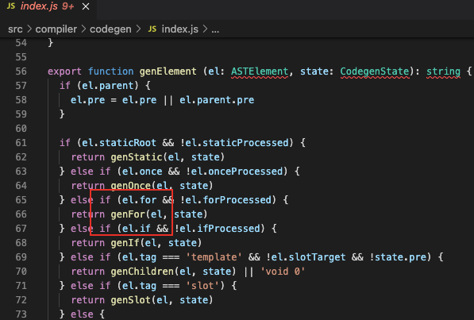
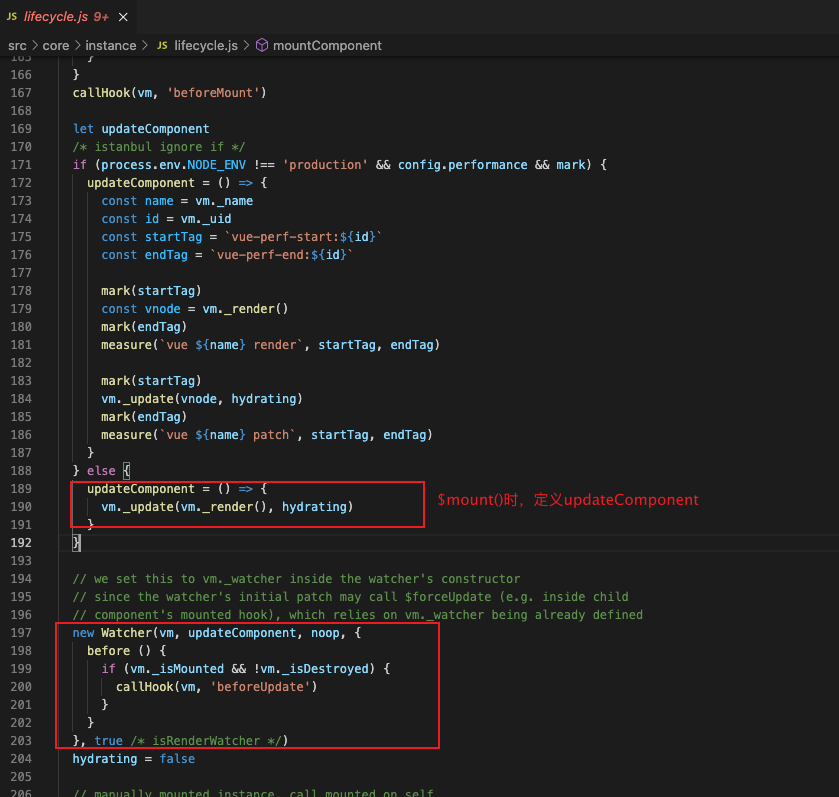
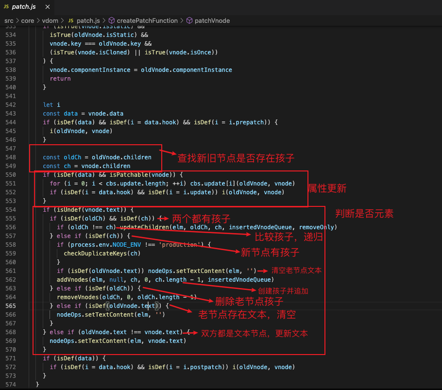
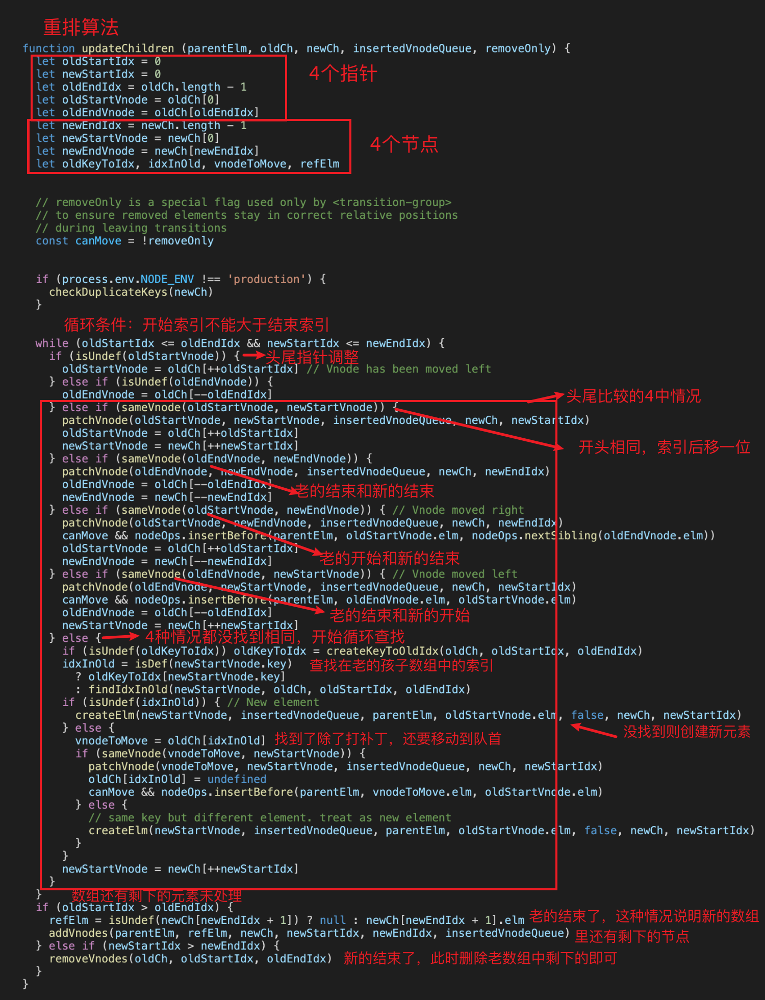
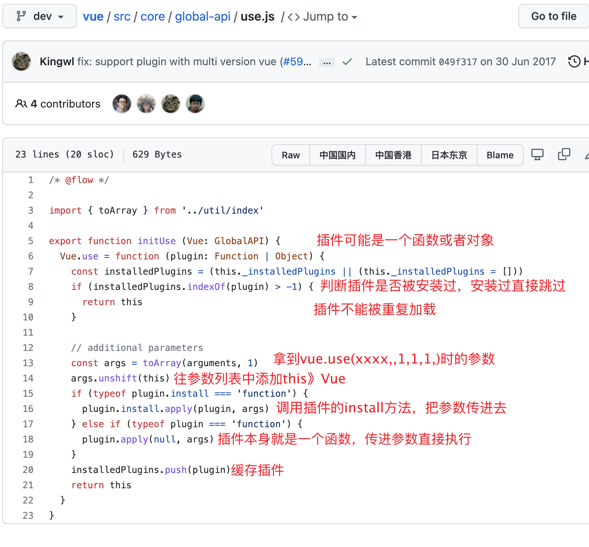

### vue组件之间通信方式

1. props 
2. $emit / $on
3. $children / $parent
4. $arts / $listeners
5. ref
6. $root
7. eventbus
8. vuex
9. Provide / inject


### vue2响应式原理

```js
function observe(obj){
  //判断类型
  if(!obj || typeof obj !== 'object'){
    return
  }
  Object.keys.forEach(key=>{
    defineReactive(obj,key,obj[key])
  })
}
function defineReactive(obj,key,val){
  //递归子属性
  observe(val);
  let dep=new Dep();//每个属性一个dep
  Object.defineProperty(obj,key,{
    //可枚举
    enumerable:true,
    //可配置
    configurable:true,
    //自定义函数
    get:function reactiveGetter(){
      if(dep.target){
        dep.depend()
      }
      return val
    },
    set:function reactiveSetter(newVal){
      val=newVal
      dep.notify()
    }
  })
}
```


### v-show和v-if的区别

- 相同点：v-show和v-if作用效果相同都是控制元素是否在页面中显示

- 不同点：
  1. 控制手段：
     - `v-show` 隐藏是为该元素添加css : display:none;  dom依旧还在
     - `v-if`  显示/隐藏是将dom元素整个添加/删除
  2. 编译过程：
     - `v-show`  css切换
     - `v-if  `切换有一个局部编译/卸载过程，切换过程中合适的销毁和重建内部的事件监听和子组件
  3. 编译条件：v-if是真正的条件渲染，它会确保在切换过程中条件块内的事件监听器和子组件适当的销毁和重建。
     - `v-show `  由false变为true时不会触发组件的生命周期
     - `v-if`由`false`变为`true`的时候，触发组件的`beforeCreate`、`create`、`beforeMount`、`mounted`钩子，由`true`变为`false`的时候触发组件的`beforeDestory`、`destoryed`方法


### v-if和v-for哪个优先级更高

- 同一元素上都存在时

  1. Vue2：v-for的优先级比v-if高,源码中判断条件如下：

     

  2. vue3：v-if比v-for优先级高

### 为什么组件data是个函数

在vue中组件是可复用的

1. 如果data是个对象它的状态将影响所有组件实例。

2. 采用函数定义，在初始化时会将其作为工厂函数返回全新的data对象，避免了多实例之间的状态污染问题

   

### key的作用

可以在源码中找到答案：src/core/vdom/patch.js    updateChildren函数


1. key的作用主要为了高效的更新虚拟dom,其原理是vue在patch过程中通过key可以精确判断两个节点是否是同一个，从而避免频繁更新不同元素，使得整个patch过程更加高效，减少DOM操作，提高性能
2. vue中使用相同标签名元素的过渡切换时，也会使用到key属性，其目的也是为了让vue可以区分它们，否则vue只会替换其内部属性而不会触发过渡效果

### vue的父子组件生命周期执行顺序

 	  加载到渲染

- 父beforeCreate > 父created  >父beforeMount >子beforeCreate > 子created >子 beforeMount >子mounted>父 mounted

  

  更新前 到更新

- 父beforeUpdate > 子beforeUpdate > 子updated > 父updated

  

  销毁前到 销毁

- 父 beforeDestroy > 子 beforeDestroy > 子destroyed > 父 destroyed


### 理解diff算法

用源码理解diff算法（vue2）

1. 必要性：scr/core/instance/lifecycle.js.  mountComponent

   - mountComponent由$mount调用：vue组件实例创建完成之后挂载时调用。

   - 一个组件调用一次$mount，并且创建一个与之相对应的wather

   - 组件中存在很多个data中key的使用，当key发生变化时执行一次diff算法，进行新旧虚拟dom的比较从而知道那些key发生了变化

     

2. 执行方式：src/core/vdom/patch.js   patchVnode

   patchVnode是diff发生的起点地方，策略：深度优先，同层比较

   

3. 高效性：patch.js  updateChildren()

   一些比较操作，增加或者删除元素

   

   

### vue.use是干什么的原理是啥

- 干什么的

  `Vue.use` 是用来使用插件的，我们可以在插件中扩展全局组建、指令、原型方法等。

- 原理是啥

  

### vue性能优化

1. 路由懒加载

2. Keep-alive缓存页面

3. 使用v-show复用dom

4. v-for遍历时避免同时使用v-if

   - 长列表性能优化

     如果只是单纯的数据展示，不会发生任何变化就不需要响应化

     可以使用Object.freeze()等方法冻结

   - 大数据长列表，采用虚拟滚动，只渲染部分区域的内容

     参考：[vue-virtual-scroller](https://www.npmjs.com/package/vue-virtual-scroller) 、[vue-virtual-scroll-list](https://www.npmjs.com/package/vue-virtual-scroll-list)

5. 事件销毁

   vue组件销毁时，会自动解绑它的全部指令及事件监听器，但仅限组件本身的事件

   我们应该在beforeDestroy()中销毁一些自己定义的定时器或者事件监听

6. 图片懒加载

   对于图片过多的页面，为了加速页面加载速度，将页面内未出现可视区域内的图片先不做加载，等滚动到可视区后再去加载

   参考：[Vue-Lazyload](https://www.npmjs.com/package/vue-lazyload)

7. 第三方插件按需引入

8. 无状态的组件标记为函数式组件

   ```html
   <template functional>
      <div>xxx<div>
   </template>
   ```

9. 子组件分割

   一些比较耗时的任务应该独立分割出来

10. SSR服务端渲染

### vue3的新特性了解

Vue3.0的改进主要以下几点：

- 更快
  - 虚拟dom重写
  - 优化slots的生成
  - 静态树提升
  - 静态属性提升
  - 基于proxt的响应式系统
- 更小: 通过树摇优化核心库体积
- 更容易维护：TypeScript+模块化
- 更加友好
  - 跨平台：编译器核心和运行时核心于平台无关，使得Vue更容易与任何平台（web、Android、ios）一起使用
- 更容易使用
  - 改进的TypeScript支持，编辑器能提供强有力的类型检查和错误及警告
  - 更好的调试支持
  - 独立的响应化模块
  - Composition API

### vuex使用和理解

- vuex并非必须的，如果我们不打算开发大型单页应用或者应用中没有大量全局状态需要维护，完全没有使用vuex的必要。一个简单的[store](https://cn.vuejs.org/v2/guide/state-management.html#%E7%AE%80%E5%8D%95%E7%8A%B6%E6%80%81%E7%AE%A1%E7%90%86%E8%B5%B7%E6%AD%A5%E4%BD%BF%E7%94%A8)模式就足够
- 使用：
  - 全局状态定义在state对象中，组件中使用store实例的state访问这些状态;
  - 修改这些状态只能通过mutation方法，在组件中调用commit方法提交mutation;
  - 如果是异步操作需要编写action,再提交mutation,在组件中调用这些action使用dispatch方法派发。
  - 模块化：通过modules选项组织拆分出去的各个子模块,在访问状态时注意添加子模块的名称，如果子模块有设置namespace,在提交mutation和派发action时还需要额外的命名空间前缀

### vue-router中保护指定路由安全

主要是考察项目实践能力，项目基本的路由守卫的需求

1. Vue-router 中路由保护策略

   Vue-router中保护路由安全通常使用导航守卫来做，通过设置路由导航钩子函数的方式添加守卫函数，在里面判断用户的登录状态和权限，从而达到保护指定路由的目的

2. 具体实现方式

   具体实现有几个层级：全局前置守卫beforeEach、路由独享守卫beforeEnter或者组件内守卫beforeRouteEnter。以全局守卫为例，可以使用router.beforeEach((to,form,next)=>{})方式设置守卫，每次路由导航时，都会执行该守卫，从而检查当前用户是否可以继续导航，通过next函数传递多种参数达到不同目的，比如如果禁止用户继续导航可以传递next(false)，正常放行可以不传递参数，传递path字符串可以重定向到一个新的地址等等

3. 它们是怎么生效的

   这和vue- router工作方式有关，像beforeEach只是组册一个hook,当路由发生变化，router准备导航前会批量执行这些hooks,并把目标路由to，当路由form，以及后续处理函数next传递给我们设置的ho ok

#### 全局守卫、路由独享守卫、组件内守卫区别

- 作用范围

  - 全局守卫所有的导航都会执行
  - 路由独享守卫只会和路由相关的会触发
  - 组件内守卫用到这个组件就会触发

- 组件实例的获取

  全局守卫、路由独享守卫得不到组件实例

  组件内守卫才能得到

  ```js
  beforeRouteEnter(to,form,next){
    next(vm=>{
       //vm就是组件实例
    })
  }
  ```

- 顺序

  1. 导航被触发
  2. 在失活的组件里调用离开的守卫
  3. 调用全局的beforeEach守卫
  4. 在重用的组件里调用beforeRouteUpdate守卫
  5. 在路由配置里调用beforeEnter
  6. 解析异步路由组件
  7. 在被激活的组件里调用beforeRouteEnter
  8. 调用全局的beforeResolve守卫（2.5+）
  9. 导航被确认
  10. 调用全局的afterEach钩子
  11. 触发dom更新
  12. 用创建好的实例调用beforeRouteEnter守卫中传给next的回调函数

### nextTick是干什么的

考察vue异步更新队列的理解

> Vue.nextTick([callback,context])
>
> 在下次DOM更新循环结束之后执行延迟回调，在修改数据之后立即使用这个方法，获取到更新后的do m.
>
> ```js
> //修改数据
> vm.msg='hello'
> Vue.nextTick(function (){
> //DOM更新了
> })
> ```

1. nextTick是vue提供的全局api，由于vue的异步更新策略导致我们对数据的修改不会立即体现在DOM变化上，此时如果想要立即获取更新后DOM状态，就需要使用这个方法
2. vue在更新DOM时是异步执行的，只要侦听到数据变化，vue将开启一个队列，并缓存在同一个事件循环中发生的所有数据变更，如果同一个watcher被多次触发，只会被推入到队列中一次。这种在缓存时去除重复数据对于避免不必要的计算和DOM操作是非常重要的。nextTick方法会在队列中加入一个回调函数，确保该函数在前面的dom操作完成后才调用

### vue响应式的理解

1. MVVM框架中解决的一个核心问题是连接数据层和视图层，通过数据驱动应用，数据变化，视图更新，要做到这点就需要对数据做响应式处理
2. vue2的数据响应式会根据数据类型来做不同处理，如果是对象则采用Object.defineProperty()定义数据拦截，当数据被访问或者变化时，我们感知并作出响应；如果数组则通过覆盖数组原型的方法，扩展它的七个变更方法，使这些方法可以额外的做更新通知，从而作出响应式。这种机制很好的解决了数据响应化的问题。但实际使用中也存在缺点：比如初始化时的递归遍历会造成性能损失；新增或者删除属性时需要用户使用Vue.set / Vue.delete这样的api才能生效；对于es6中的Map,Set这种数据结构不支持等问题

