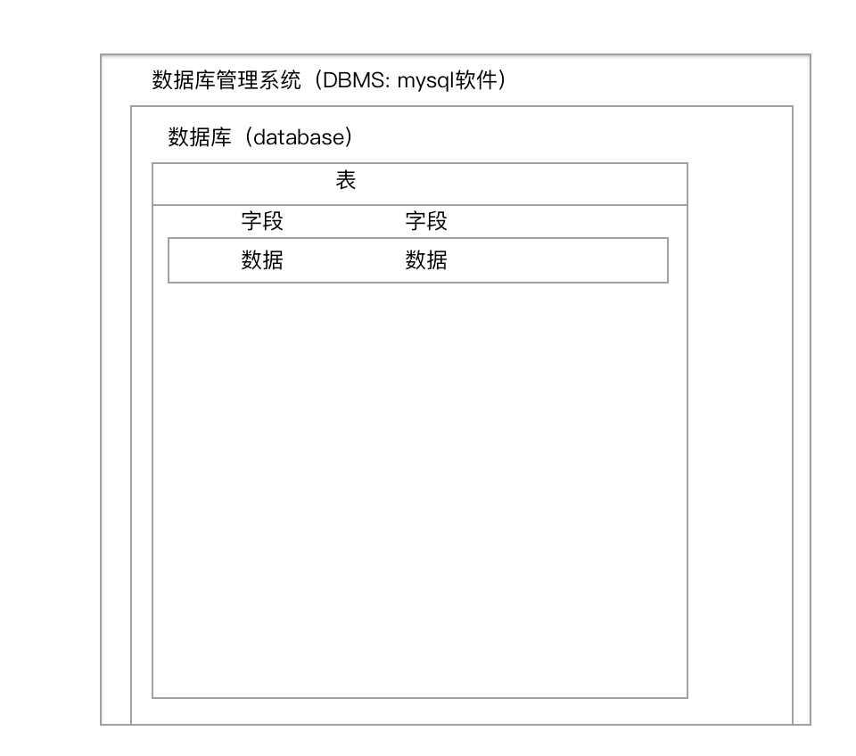
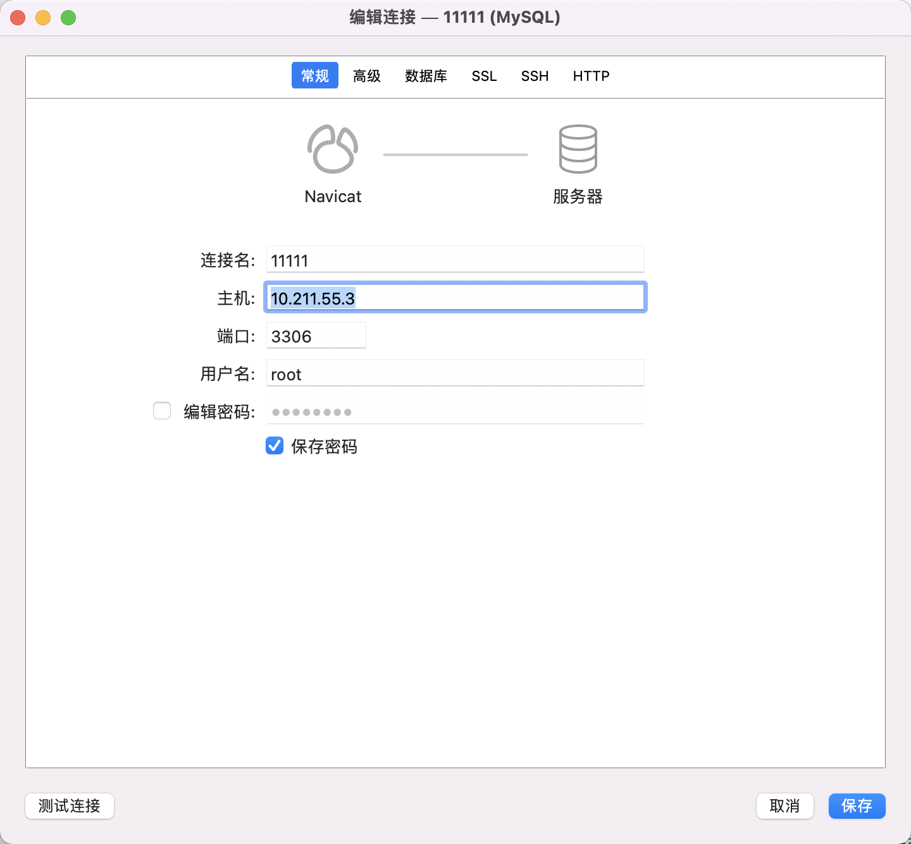
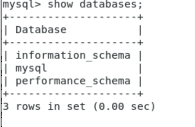
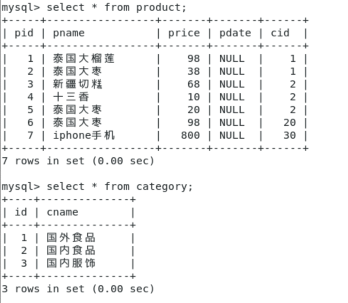
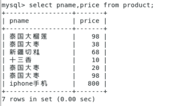
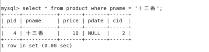
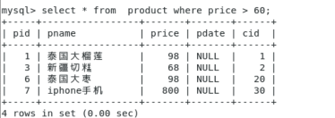
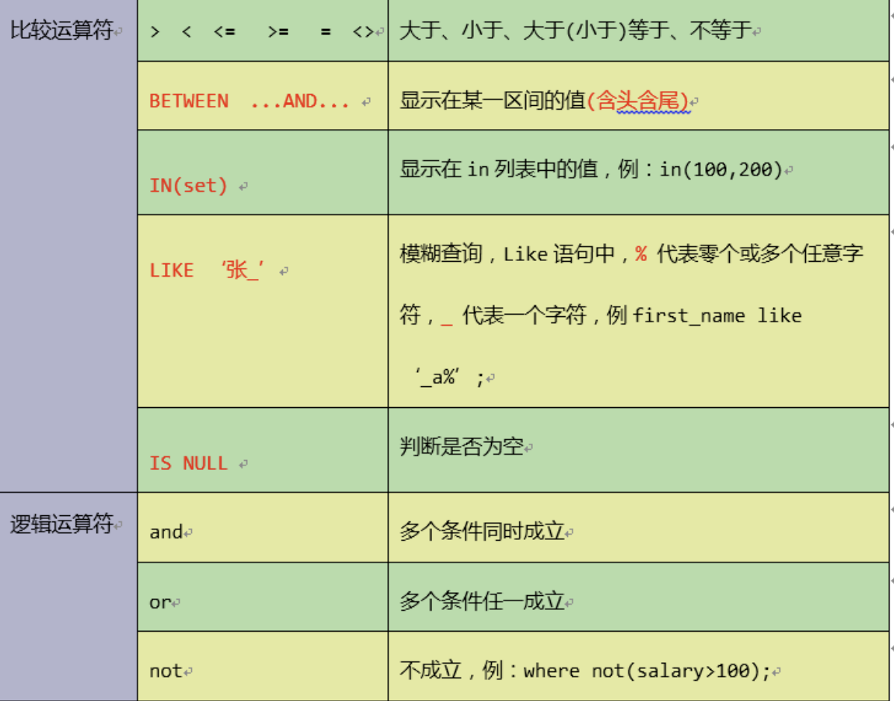

# 从零到1掌握mySQL

## 理解关系型数据库的概念

> 如果你对这些不感兴趣，可以跳过

### 数据库概述

#### 什么是数据库

> 数据库就是储存数据的仓库，其本质就是一个[文件系统]，数据按照特定的格式储存起来，用户可以通过SQL对数据库中的数据进行增加、删除、修改、查询操作

#### 什么是关系型数据库

> 数据库中的记录是有行有列的就是关系型数据库，与之相反的就是NoSQL数据库

#### 数据库和表



> 数据库管理系统：指一种[操作和管理数据库]的大型软件，用于建立、使用和维护数据库，对数据库进行统一管理和控制，以保证数据库的安全性和完整性。用户通过数据库管理系统访问数据库中表内的数据


## 了解mysql历史

> \- MySQL的历史可以追溯到1979年，一个名为Monty Widenius的程序员在为TcX的小公司打工，并且用 BASIC设计了一个报表工具，使其可以在4MHz主频和16KB内存的计算机上运行。当时，这只是一个很底层的 且仅面向报表的存储引擎，名叫Unireg。
>
> \- 1990年，TcX公司的客户中开始有人要求为他的API提供SQL支持。Monty直接借助于mSQL的代码，将 它集成到自己的存储引擎中。令人失望的是，效果并不太令人满意，决心自己重写一个SQL支持。
>
> \- 1996年，MySQL 1.0发布，它只面向一小拨人，相当于内部发布
>
> 1990年，TcX公司的客户中开始有人要求为他的API提供SQL支持。Monty直接借助于mSQL的代码，将 它集成到自己的存储引擎中。令人失望的是，效果并不太令人满意，决心自己重写一个SQL支持。
>
> \- 1996年，MySQL 1.0发布，它只面向一小拨人，相当于内部发布。
>
> \- 到了1996年10月，MySQL 3.11.1发布(MySQL没有2.x版本)，最开始只提供Solaris下的二进制版 本。一个月后，Linux版本出现了。在接下来的两年里，MySQL被依次移植到各个平台。
>
> \- 【1999~2000年】，【MySQL AB】公司在瑞典成立。Monty雇了几个人与Sleepycat合作，开发出 了【Berkeley DB引擎】, 由于BDB支持事务处理，因此MySQL从此开始支持事务处理了。
>
> \- 2000，MySQL不仅公布自己的源代码，并采用GPL(GNU General Public License)许可协议，正 式进入开源世界。同年4月，MySQL对旧的存储引擎ISAM进行了整理，将其命名为MyISAM。
>
> \- 2001年，集成Heikki Tuuri的存储引擎【InnoDB】，这个引擎不仅能【支持事务处理，并且支持行 级锁】。后来该引擎被证明是最为成功的MySQL事务存储引擎。【MySQL与InnoDB的正式结合版本是4.0】
>
> \- 2003年12月，【MySQL 5.0】版本发布，提供了视图、存储过程等功能。
>  \- 【2008年1月】，【MySQL AB公司被Sun公司以10亿美金收购】，MySQL数据库进入Sun时代。在Sun
>
> 时代，Sun公司对其进行了大量的推广、优化、Bug修复等工作。
>  \- 2008年11月，MySQL 5.1发布，它提供了分区、事件管理，以及基于行的复制和基于磁盘的NDB集群系
>
> 统，同时修复了大量的Bug。
>  \- 【2009年4月】，Oracle公司以74亿美元收购Sun公司，自此MySQL数据库进入Oracle时代，而其第
>
> 三方的存储引擎InnoDB早在2005年就被Oracle公司收购。
>
> \- 2010年12月，【MySQL 5.5发布】，其主要新特性包括半同步的复制及对SIGNAL/RESIGNAL的异常 处理功能的支持，【最重要的是InnoDB存储引擎终于变为当前MySQL的默认存储引擎】。MySQL 5.5不是时 隔两年后的一次简单的版本更新，而是加强了MySQL各个方面在企业级的特性。Oracle公司同时也承诺 MySQL 5.5和未来版本仍是采用GPL授权的开源产品


#### SQL

> ​       SQL是Structured Query Language的缩写】，它的前身是著名的关系数据库原型系统System R所采 用的SEQUEL语言。作为一种访问【关系型数据库的标准语言】，SQL自问世以来得到了广泛的应用，不仅是著 名的大型商用数据库产品Oracle、DB2、Sybase、SQL Server支持它，很多开源的数据库产品如 PostgreSQL、MySQL也支持它，甚至一些小型的产品如Access也支持SQL。近些年蓬勃发展的NoSQL系统 最初是宣称不再需要SQL的，后来也不得不修正为Not Only SQL，来拥抱SQL。
>
> 蓝色巨人IBM对关系数据库以及SQL语言的形成和规范化产生了重大的影响，第一个版本的SQL标准SQL86 就是基于System R的手册而来的。Oracle在1979年率先推出了支持SQL的商用产品。随着数据库技术和应 用的发展，为不同RDBMS提供一致的语言成了一种现实需要。
>
> 对SQL标准影响最大的机构自然是那些著名的数据库产商，而具体的制订者则是一些非营利机构，例如 【国际标准化组织ISO、美国国家标准委员会ANSI】等。各国通常会按照 ISO标准和ANSI标准(这两个机构 的很多标准是差不多等同的)制定自己的国家标准。中国是ISO标准委员会的成员国，也经常翻译一些国际标 准对应的中文版。标准为了避免采用具体产品的术语，往往会抽象出很多名词，从而增加了阅读和理解的难 度，翻译成中文之后更容易词不达意。对于数据库系统实现者和用户而言，很多时候还不如直接读英文版本为 好。虽然正式的标准不像RFC那样可以从网络上免费获得，标准草案还是比较容易找到的(例如: http://www.jtc1sc32.org/doc/)。待批准的标准草案和最终的标准也没有什么实质上的区别，能够满 足日常工作的需要。
>
> 下面是SQL发展的简要历史:
>  1986年，ANSI X3.135-1986，ISO/IEC 9075:1986，SQL-86 1989年，ANSI X3.135-1989，ISO/IEC 9075:1989，SQL-89 1992年，ANSI X3.135-1992，ISO/IEC 9075:1992，SQL-92(SQL2) 1999年，ISO/IEC 9075:1999，SQL:1999(SQL3)
>
> 2003年，ISO/IEC 9075:2003，SQL:2003 2008年，ISO/IEC 9075:2008，SQL:2008 2011年，ISO/IEC 9075:2011，SQL:2011
>
> 如果要了解标准的内容，比较推荐的方法是【泛读SQL92】(因为它涉及了SQL最基础和最核心的一些内 容)，然后增量式的阅读其他标准。

> 不只是mysql还有其他数据库，在SQL92或者SQL99这些国际SQL标准基础之上，它们还扩展了自己的一些 SQL语句，比如MySQL中的limit关键字

#### Sql语言分类

> \- 数据定义语言:简称【DDL】(Data Definition Language)，用来定义数据库对象:数据库，表，列 等。关键字:create，alter，drop等
>
> \- 数据操作语言:简称【DML】(Data Manipulation Language)，用来对数据库中表的记录进行更 新。关键字:insert，delete，update等
>
> \- 数据控制语言:简称【DCL】(Data Control Language)，用来定义数据库的访问权限和安全级别， 及创建用户;关键字:grant等
>
> \- 数据查询语言:简称【DQL】(Data Query Language)，用来查询数据库中表的记录。关键字: select，from，where等

## 掌握mysql在linux下的安装和远程连接

### mysql基础

> 使用虚拟机
>
> 操作系统：centOS 7.+
>
> MySQL: 5.6

### 安装mysql

```bash
#下载rpm文件
wget http://repo.mysql.com/mysql-community-release-el6-5.noarch.rpm #执行rpm源文件
rpm -ivh mysql-community-release-el6-5.noarch.rpm
#执行安装文件
yum install mysql-community-server
```

wget 时提示 -bash:wget command not found,很明显没有安装wget软件包。一般[linux](https://so.csdn.net/so/search?from=pc_blog_highlight&q=linux)最小化安装时，wget不会默认被安装,安装wget

```
yum install wget
```

### 启动服务

```
systemctl start mysqld
```

### 重启服务

```
systemctl restart mysqld
```


### **mysql的卸载**

#### 查看mysql

```
rpm -qa|grep mysql
yum repolist all | grep mysql
```

#### 卸载mysql

```bash
yum remove -y mysql mysql-libs mysql-common #卸载mysql
rm -rf /var/lib/mysql #删除mysql下的数据文件
rm /etc/my.cnf #删除mysql配置文件
yum remove -y mysql-community-release-el6-5.noarch #删除组件
```


#### 设置root用户密码

```
没设置过密码
/usr/bin/mysqladmin -u root password 'root'

设置过密码
/usr/bin/mysqladmin -u root -p '旧密码' password 'root'
```


### 登录mysql

```
mysql -uroot -proot
```

> -u:指定数据库用户名 
>
> -p:指定数据库密码，记住-u和登录密码之间没有空格

### 退出mysql命令行命令

quit;

```bash
#示例
mysql>quit;
```

或者按两次

mac: command+c

Windows: ctrl+c

### 配置mysql

```
vim /etc/my.cnf
```

**按 i键  可修改模式**

**修改内容如下**

```bash
[mysql]
# MySQL设置大小写不敏感:默认:区分表名的大小写，不区分列名的大小写 # 0:大小写敏感 1:大小写不敏感
lower_case_table_names=1
# 默认字符集
character-set-server=utf8
```

**按esc键退出 修改**

**输入 :wq 回车保存**

## mysql远程连接授权

**授权命令**

```
grant 权限 on 数据库对象 to 用户
```

**示例**

授权root用户对所有数据库对象的全部操作权限：

```
GRANT ALL PRIVILEGES ON *.* TO 'root'@'%' IDENTIFIED BY 'root' WITH GRANT OPTION;
```

命令说明：

- ALL PRIVILEGES：表示授予所有的权限，此处可以指定具体的授权权限 

- ###### * *.* * ：表示所有库中的所有表

- 'root'@'%' ： root是数据库的用户名，%是表示是任意ip地址,可以指定具体ip地址。

- IDENTIFIED BY 'root' ：root是数据库的密码

```
FLUSH PRIVILEGES;--刷新权限
```


### 关闭防火墙

```
systemctl stop firewalld(默认)
systemctl disable firewalld.service(设置开机不启动)
```

### 客户端远程访问

如果你不知道当前虚拟机的ip

```
ip address |sed -rn '/state UP/{n;n;s#^ *inet (.*)/.*$#\1#gp}'
```

```
利用navicat可以远程访问MySQL
```



## ddl语句

**数据库操作：database**

### 创建数据库

```
create database 数据库名;
create database 数据库名 character set 字符集;
```


### 查看数据库

查看数据库服务器中的所有的数据库；

```
show databases;
```



查看某个数据库的定义的信息；

```
show create database 数据库名;
```


### 删除数据库

```
drop database 数据库名;
```


### 其他数据库操作命令

```
use 数据库名; #使用xxx数据库
```


### 查看正在使用的数据库；

```
select database()
```


### 表操作：table

### 字段类型

- 常见的类型：

  ```
  数字类型：int
  
  浮点类型：double
  
  字符型：varchar（可变长字符型）
  
  日期类型：data（只有年月日）；datatime(年月日时分秒)
  
  boolean类型：不支持，一般使用tinyint代替（值为0和1）
  ```

### 创建表

```
create table 表名(
  字段名 类型（长度）约束,
  字段名 类型（长度）约束
);
```

#### 单表约束

```
- 主键约束：primary key

- 唯一约束：unique

- 非空约束：not null
```

**注意**

主键约束 = 唯一约束+非空约束


### 查看表

查看数据库中的所有表：

```
show tables;
```


查看表结构

```
desc 表名;
```


### 删除表

```
drop table 表名;
```


### 修改表

```
alter table 表名 add 列名 类型(长度) 约束;  --修改表添加列

alter table 表名 modify 列名 类型(长度) 约束;  --修改表修改列的类型长度及约束

alter table 表名 change 旧列名 新列名 类型(约束) 约束; --修改表修改列名

alter table 表名 drop 列名;  --修改表删除列

rename table 表名 to 新表名;  --修改表名

alter table 表名 character set 字符集;  --修改表的字符集
```


## DML语句

### 插入记录：insert

- 语法：

  ```
  insert into 表 (列名1，列名2，列名...) values （值1,值2,值3...）; 向表中插入某些列
  
  
  insert into 表 values (值1,值2,值3...);  向表中插入点所有列
  
  
  insert into 表 (列名1,列名2,列名3...) values select （列名1，列名2,列名3..） from 表
  
  
  insert into 表 values select * from 表
  ```

- 注意：

  1. 列名数与values后面的值的个数相等
  2. 列的顺序与插入的值得顺序一致
  3. 列名的类型与插入的值要一致
  4. 插入值的时候不得超过最大长度
  5. 值如果的字符串或者日期需要加引号''（一般是单引）

- 例如：

```mysql
INSERT INTO sort(sid,sname) VALUES('s001', '电器'); 

INSERT INTO sort(sid,sname) VALUES('s002', '服饰');

INSERT INTO sort VALUES('s003', '化妆品');

INSERT INTO sort VALUES('s004','书籍');
```


### 更新记录：update

- 语法：

```
update 表名 set 字段名=值,字段名=值;

update 表名 set 字段名=值,字段名=值 where 条件;
```

- 注意 
  1. 列名的类型与修改的值要一致
  2. 修改值的时候不能超过最大长度
  3. 值如果是字符串或者日期需要加''


### 删除记录：delete

- 语法

  ```
  delete from 表名 [where 条件];
  ```

- 面试题

  ```
  删除表中所有记录使用【delete from 表名】，还是用【truncate table 表名】?
  删除方式:
  - delete :一条一条删除，不清空auto_increment记录数。
  - truncate :直接将表删除，重新建表，auto_increment将置为零，从新开始。
  ```


## dql语句

**准备工作**

创建数据库 

```
create database test;
```

使用test数据库

```
use test;
```

创建商品表：

```mysql
#商品表

CREATE TABLE product (
  pid int primary key auto_increment, #自增加 auto_increment
  pname varchar(20),#商品名称
  price double,#商品价格
  pdate date,#日期
  cid int #分类id
)ENGINE=MyISAM DEFAULT CHARSET=utf8;##设置编码 否则插入数据时一些版本可能会报错

##  Incorrect string value: '\xE6\x89\x8B\xE6\x9C\xBA' for column 'pname' at row 1

##这类错误都是编码不一致

#目录表

create table category(
  id int primary key,
  cname varchar(100)
)ENGINE=MyISAM DEFAULT CHARSET=utf8;


insert into product values(null,'泰国大榴莲',98,null,1);
insert into product values(null,'泰国大枣',38,null,1);
insert into product values(null,'新疆切糕',68,null,2);
insert into product values(null,'十三香',10,null,2);
insert into product values(null,'泰国大枣',20,null,2);
insert into product values(null,'泰国大枣',98,null,20);#没有对应
insert into product values(null,'iphone手机',800,null,30);#没有对应

#没有对应是指商品类型没有对应的目录或者商品，不必困惑

insert into category values(1,'国外食品');
insert into category values(2,'国内食品');
insert into category values(3,'国内服饰');#没有对应
```


查看表中数据

```mysql
select * from product;
select * from category;
```





### 完整dql语法顺序

```mysql
select distinct  
    < select_list >
from 
    < left_table > < join_type>
join < right_table > on < join_condition >
where 
    < where_codition >
group by
    < group_by_list >
having
    < having_condition >
order by
    < order_by_condition >
limit < limit_number >
```

- distinct 去重复 要查的东西
- from  从这个表中
- join 连哪个表
- on 连接条件
- where 过滤条件
- group by 分组
- having 分组条件
- order by 排序
- limit 分页

#### 简单查询

- SQL语法关键字

  ```
  select 
  from
  ```

- 案例

  1. 查询所有的商品

     ```
     select * form product;
     *是所有
     product 表
     ```

  2. 查询商品名和商品价格

     ```
     select pname,price from product;
     ```

     

  3. 别名查询，使用的**as**关键字,as可以省略

     表别名：

     ```mysql
     select * from product as p;
     ```

     列别名：

     ```mysql
     select pname as pn from product;
     ```

  4. 去掉重复值

     ```mysql
     select distinct price from product;
     ```

  5. 查询结果是表达式（运算查询）：将所有商品的价格+10元进行显示

     ```mysql
     select pname,price+10 from product;
     ```

#### 条件查询

- SQL语法关键词:

  ```
  where
  ```

- 案例：

  1. 查询商品名称为十三香的商品所有信息

     ```mysql
     select * from product where pname = '十三香';
     ```

     

  2. 查询商品价格 > 60元的所有商品信息；

     ```mysql
     select * from  product where price > 60;
     ```

     

- where后的条件写法

  ```
  >,<,=,>=,<=,<>
  
  like 使用占位符 - 和 % _代表一个字符 %代表任意个字符。
     select * from product where pname like '%新%';
  in在某个范围中获得值（exists）
    select * from product where pid in (2,5,8);
  ```

  

#### 

#### 排序

- SQL语法关键字

  ```
  order by
  
  ASC(升序)  DESC(降序)
  ```

- 案例

  1. 查询所有的商品，按价格进行排序（asc-升序，desc-降序）

     ```
     select * from product order by price;
     ```

  2. 查询名称有新的商品的信息并且按价格降序排序

     ```
     select * from product where pname like '%新%' order by price desc;
     ```


#### 聚合函数（组函数）

- 特点：只对单列进行操作

- 常用的聚合函数

  ```
  sum():求某一列的和
  avg():求某一列的平均值
  max():求某一列的最大值
  min():求某一列的最小值
  count():求某一列的元素个数
  ```

- 案例：

  1. 获得所有商品的价格的总和

     ```
     select sum(price) from product;
     ```

  2. 获得所有商品的平均价格

     ```
     select avg(price) from product;
     ```

  3. 获得所有商品的个数

     ```
     select count(*) from product;
     ```

#### 分组

- SQL语法关键字

  ```
  group by
  
  having
  ```

- 案例：

  1. 根据cid字段分组，分组后统计商品的个数

     ```
     select cid,count(*) from product group by cid;
     ```

  2. 根据cid分组，分组统计每组商品的平均价格，并且平均价格>60；

     ```
     select cid,avg(price) from product group by cid having avg(price) > 60;
     ```

- 注意事项：

  1. select语句中的列（非聚合函数列）,必须出现在group by子句中
  2. group by子句中的列，不一定要出现在select语句中
  3. 聚合函数只能出现select语句中或者having语句中，一定不能出现where语句中

#### 分页查询

- 关键字：

  ```
  limit [offset,] rows
  ```

  **limit关键字不是SQL92标准提出的关键字，它是MySQL独有的语法**。

  通过limit关键字，MySQL实现了物理分页。

  

  分页分为**逻辑分页**和**物理分页**：

  ```
  逻辑分页：将数据库中的数据查询到内存之后再进行分页。
  
  
  物理分页：通过limit关键字，直接在数据库中进行分页，最终返回的数据是分页后的数据
  ```

- 格式：

  ```
  select * from table limit [offset,] rows;
  ```

  offset：偏移量（跳过多少条）

  rows：每页多少行记录

- 案例

  ```
  分页查询商品表，每页3条记录，查第一页
  select * from product limit 0,3;
  ```

### 子查询

- 定义

  ```
  子查询允许把一个查询嵌套在另一个查询当中。
  
  子查询，又叫内部查询或者嵌套查询，相对于内部查询，包含内部查询的查询语句就称为外部查询。
  
  子查询可以包含普通select可以包括的任意子句，比如：distinct、group by 、order by、limit、join和union等。
  
  但是对应的外部查询必须是以下语句之一：select、insert、update、delete、set和do
  
  使用的操作符: = > < >= <= <> ANY IN SOME ALL EXISTS 
  
  
  ```

  子查询分为如下几类：

  1. 标量子查询：返回单一值的标量，最简单的形式。

     ```
     　是指子查询返回的是单一值的标量，如一个数字或一个字符串，也是子查询中最简单的返回形式。 可以使用 = > < >= <= <> 这些操作符对子查询的标量结果进行比较，通常子查询的位置在比较式的右侧
     ```

     ```
     select * from product where price = (select price from product where price=10);
     
     select * from product where price = (select MAX(price) from product);
     
     ```

     

     2. 列子查询：返回的结果集是 N 行一列。

           ```
           指子查询返回的结果集是 N 行一列，该结果通常来自对表的某个字段查询返回。
           可以使用 = > < >= <= <> 这些操作符对子查询的标量结果进行比较，通常子查询的位置在比较式的右侧。
           可以使用 IN、ANY、SOME 和 ALL 操作符，不能直接使用 = > < >= <= <> 这些比较标量结果的操作符。
           ```

           ```
           SELECT * FROM product WHERE cid IN(SELECT cid FROM product WHERE cid=2);
           
           SELECT cid FROM product WHERE cid > ANY (SELECT id FROM category);
           
           SELECT cid FROM product WHERE cid > ALL (SELECT id FROM category);
           ```

           - 注意：

             NOT IN 是 <> ALL 的别名，二者相同。
             特殊情况
             　   如果 category 为空表，则 ALL 后的结果为 TRUE；
             　   如果子查询返回如 (0,NULL,1) 这种尽管 cid 比返回结果都大，但有空行的结果，则 ALL 后的结果为 UNKNOWN 。

             

     2. 行子查询：返回的结果集是一行 N 列。

           ```
           指子查询返回的结果集是一行 N 列，该子查询的结果通常是对表的某行数据进行查询而返回的结果集。
           
           ```

           ```
           select * from category where (id,cname) = (select id,cname from category where id=2);
           ```

           

     3. 表子查询：返回的结果集是 N 行 N 列。

           ```
           指子查询返回的结果集是 N 行 N 列的一个表数据。
           ```

           ```
            select * from product where (pname,price,pid) in (select pname,price,pid from product);
           ```

           

  **一个子查询会返回一个标量（就一个值）、一个行、一个列或一个表，这些子查询称之为标量、行、列和表子查询。**

  ```
    如果子查询返回一个标量值（就一个值），那么外部查询就可以使用：=、>、<、>=、<=和<>符号进行比较判断；如果子查询返回的不是一个标量值，而外部查询使用了比较符和子查询的结果进行了比较，那么就会抛出异常。
  ```


- 位置

  ```
  select中、from后、where中。
  
  group by和order by中无实用意义。
  ```

- 注意

  ```
  一般在子查询中，程序先运行在嵌套在最内层的语句，再运行外层。因此在写子查询语句时，可以先测试下内层的子查询语句是否输出了想要的内容，再一层层往外测试，增加子查询正确率。否则多层的嵌套使语句可读性很低。
  ```

  

## 理解sql解析顺序

接下来再走一步，让我们看看一条SQL语句的前世今生。

首先看一下示例语句:

```mysql
SELECT DISTINCT
    < select_list >
FROM
    < left_table > < join_type >
JOIN < right_table > ON < join_condition >
WHERE
    < where_condition >
GROUP BY
    < group_by_list >
HAVING
    < having_condition >
ORDER BY
    < order_by_condition >
LIMIT < limit_number >
```

然而它的执行顺序是这样的:

```mysql
--行过滤
 1 from <left_table>
 2 on <join_condition>
 3 <join_type> join <right_table> 第二部和第三部会循环执行
 4 where <where_condition> 第四部会循环执行，多个条件的执行顺序是从左往右。
 5 group by <group_by_list> 
 6 having <having_condition> 
 --列过滤
 7 select 分组之后才会执行select
 8 distinct <select_list>
 --排序
 9 order by <order_by_condition> 
 --mysql 附加
 10 limit <limit_number> 
```

虽然自己没想到是这样的，不过一看还是很自然和谐的，从哪里获取，不断的过滤条件，要选择一样或
不一样的，排好序，那才知道要取前几条呢。
既然如此了，那就让我们根据案例一步步来看看其中的细节吧。


**开始sql解析之旅**

### from

对from的左边的表和右边的表计算 **笛卡尔积（cross join）**。产生 **虚表VT1**

```mysql
mysql> select * from product,category;
+-----+-----------------+-------+-------+------+----+--------------+
| pid | pname           | price | pdate | cid  | id | cname        |
+-----+-----------------+-------+-------+------+----+--------------+
|   1 | 泰国大榴莲      |    98 | NULL  |    1 |  1 | 国外食品     |
|   1 | 泰国大榴莲      |    98 | NULL  |    1 |  2 | 国内食品     |
|   1 | 泰国大榴莲      |    98 | NULL  |    1 |  3 | 国内服饰     |
|   2 | 泰国大枣        |    38 | NULL  |    1 |  1 | 国外食品     |
|   2 | 泰国大枣        |    38 | NULL  |    1 |  2 | 国内食品     |
|   2 | 泰国大枣        |    38 | NULL  |    1 |  3 | 国内服饰     |
|   3 | 新疆切糕        |    68 | NULL  |    2 |  1 | 国外食品     |
|   3 | 新疆切糕        |    68 | NULL  |    2 |  2 | 国内食品     |
|   3 | 新疆切糕        |    68 | NULL  |    2 |  3 | 国内服饰     |
|   4 | 十三香          |    10 | NULL  |    2 |  1 | 国外食品     |
|   4 | 十三香          |    10 | NULL  |    2 |  2 | 国内食品     |
|   4 | 十三香          |    10 | NULL  |    2 |  3 | 国内服饰     |
|   5 | 泰国大枣        |    20 | NULL  |    2 |  1 | 国外食品     |
|   5 | 泰国大枣        |    20 | NULL  |    2 |  2 | 国内食品     |
|   5 | 泰国大枣        |    20 | NULL  |    2 |  3 | 国内服饰     |
|   6 | 泰国大枣        |    98 | NULL  |   20 |  1 | 国外食品     |
|   6 | 泰国大枣        |    98 | NULL  |   20 |  2 | 国内食品     |
|   6 | 泰国大枣        |    98 | NULL  |   20 |  3 | 国内服饰     |
|   7 | iphone手机      |   800 | NULL  |   30 |  1 | 国外食品     |
|   7 | iphone手机      |   800 | NULL  |   30 |  2 | 国内食品     |
|   7 | iphone手机      |   800 | NULL  |   30 |  3 | 国内服饰     |
+-----+-----------------+-------+-------+------+----+--------------+
21 rows in set (0.00 sec)
```

### on过滤

对虚表v t1进行on过滤，只有那些符合的行才会被记录在虚表vt2中。

**注意：**这里因为语法限制，使用了where代替，从中读者也可以感受到两者之间微妙的关系。

```mysql
mysql> select * from product p,category c where p.cid=c.id;
+-----+-----------------+-------+-------+------+----+--------------+
| pid | pname           | price | pdate | cid  | id | cname        |
+-----+-----------------+-------+-------+------+----+--------------+
|   1 | 泰国大榴莲      |    98 | NULL  |    1 |  1 | 国外食品     |
|   2 | 泰国大枣        |    38 | NULL  |    1 |  1 | 国外食品     |
|   3 | 新疆切糕        |    68 | NULL  |    2 |  2 | 国内食品     |
|   4 | 十三香          |    10 | NULL  |    2 |  2 | 国内食品     |
|   5 | 泰国大枣        |    20 | NULL  |    2 |  2 | 国内食品     |
+-----+-----------------+-------+-------+------+----+--------------+
5 rows in set (0.00 sec)
```

### outer join添加外部列

如果指定了outer join (比如left join 、right join),那么 **保留表中未匹配的行**  就会作为外部行添加到虚拟表vt2中，产生虚拟表 vt3。

如果from子句中包含两个以上的表的话，那么就会对上一个join连接产生的结果vt3和下一个表重复执行步骤1～3三个步骤，一直到处理完所有的表为止。

```mysql
mysql> select * from product p left outer join category c on p.cid=c.id;# 以左表 数据为准
+-----+-----------------+-------+-------+------+------+--------------+
| pid | pname           | price | pdate | cid  | id   | cname        |
+-----+-----------------+-------+-------+------+------+--------------+
|   1 | 泰国大榴莲      |    98 | NULL  |    1 |    1 | 国外食品     |
|   2 | 泰国大枣        |    38 | NULL  |    1 |    1 | 国外食品     |
|   3 | 新疆切糕        |    68 | NULL  |    2 |    2 | 国内食品     |
|   4 | 十三香          |    10 | NULL  |    2 |    2 | 国内食品     |
|   5 | 泰国大枣        |    20 | NULL  |    2 |    2 | 国内食品     |
|   6 | 泰国大枣        |    98 | NULL  |   20 | NULL | NULL         |
|   7 | iphone手机      |   800 | NULL  |   30 | NULL | NULL         |
+-----+-----------------+-------+-------+------+------+--------------+
7 rows in set (0.00 sec)

mysql> select * from product p right outer join category c on p.cid=c.id;#以右表 数据为准
+------+-----------------+-------+-------+------+----+--------------+
| pid  | pname           | price | pdate | cid  | id | cname        |
+------+-----------------+-------+-------+------+----+--------------+
|    1 | 泰国大榴莲      |    98 | NULL  |    1 |  1 | 国外食品     |
|    2 | 泰国大枣        |    38 | NULL  |    1 |  1 | 国外食品     |
|    3 | 新疆切糕        |    68 | NULL  |    2 |  2 | 国内食品     |
|    4 | 十三香          |    10 | NULL  |    2 |  2 | 国内食品     |
|    5 | 泰国大枣        |    20 | NULL  |    2 |  2 | 国内食品     |
| NULL | NULL            |  NULL | NULL  | NULL |  3 | 国内服饰     |
+------+-----------------+-------+-------+------+----+--------------+
6 rows in set (0.00 sec)

```


### where 

对虚拟表 vt3 进行where 条件过滤，只有符合的记录才会被插入到虚拟表vt4中。

**注意：**

此时因为分组，不能使用聚合运算；也不能使用select中创建的别名;

**与on的区别：**

- 如果有外部列，on针对过滤的是关键表，主表（保留表）会返回所有列；
- 如果没有添加外部列，两者的效果是一样的；

**应用：**

- 对主表的过滤应该放在where;

- 对与关联表，先条件查询后连接则用on，先连接后条件查询则用where;

  ```mysql
  mysql> select * from product p left outer join category c on p.cid=c.id where p.pname='泰国大枣';
  +-----+--------------+-------+-------+------+------+--------------+
  | pid | pname        | price | pdate | cid  | id   | cname        |
  +-----+--------------+-------+-------+------+------+--------------+
  |   2 | 泰国大枣     |    38 | NULL  |    1 |    1 | 国外食品     |
  |   5 | 泰国大枣     |    20 | NULL  |    2 |    2 | 国内食品     |
  |   6 | 泰国大枣     |    98 | NULL  |   20 | NULL | NULL         |
  +-----+--------------+-------+-------+------+------+--------------+
  3 rows in set (0.00 sec)
  
  ```

  

## 理解多表间关联

## 掌握多表关联查询及子查询